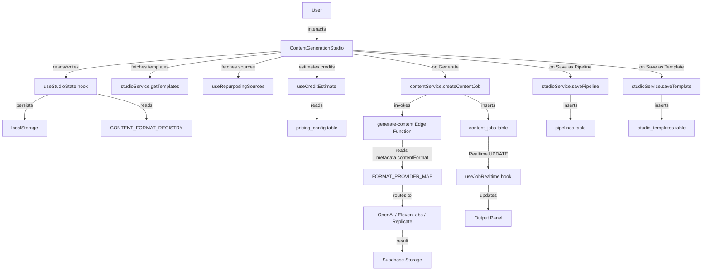

# Design Document — Content Generation Studio

## Overview

The Content Generation Studio replaces the existing `ContentHub` stub with a full-featured, creator-focused workspace. It is rendered at both `/content` and `/content/studio` (no redirect — both routes mount the same component), preserving the existing "Create" nav link without any routing change.

The Studio introduces a two-level content taxonomy (`ContentCategory` → `ContentFormat`), a `CONTENT_FORMAT_REGISTRY` constant that drives the entire UI, a `PlatformConstraints` system for pre-generation validation, a Template Library backed by a new `studio_templates` table, a Save-as-Pipeline flow backed by a new `pipelines` table, a Repurposing Engine for transforming existing assets, and a structured `ContentFormatMetadataSchema` that makes `content_jobs.metadata` forward-compatible with Phase 2–4.

All data access uses the existing `supabase` client from `src/lib/supabase.ts`. No new HTTP clients or state management libraries are introduced. State is managed via a master `useStudioState` hook plus focused sub-hooks, following the same pattern as `ContentHub`.

### Key Design Decisions

**`CONTENT_FORMAT_REGISTRY` as a frontend constant (not a DB table)**
Phase 1 has a fixed, known set of 74 formats. Storing them in a DB table would add a round-trip on every Studio mount, require a migration for every Phase 2 addition, and complicate the phase-gate logic. A TypeScript constant is tree-shaken, type-safe, and zero-latency. When Phase 2 formats are ready, they are added to the constant behind a feature flag — no migration needed.

**Two-level selector: tabs + scrollable grid**
The five `ContentCategory` options are rendered as a horizontal tab bar (matching the existing `ContentHub` type selector pattern). Selecting a tab reveals a scrollable grid of `ContentFormat` cards for that category. This avoids deep nesting (accordion) and keeps all formats visible at a glance without overwhelming the user with all 74 at once.

**`PlatformConstraints` as advisory hints, not hard blockers**
Constraints are surfaced as inline hints adjacent to the platform selector and as pre-generation warnings. The Generate button is disabled only when a character-limit constraint is violated (measurable) or a required constraint input is missing. Aspect ratio and duration constraints are surfaced as required inputs in the Advanced Options panel for the relevant formats. This avoids blocking users who are using the Studio to draft content that will be manually adjusted before publishing.

**Repurposing Engine as an inline tab, not a modal**
The Repurpose Content mode is toggled via a tab/segmented control at the top of the Configuration Panel (alongside the standard "Create" mode). This keeps the full Studio layout intact — the Output Panel, credit estimate, and Generate button all remain visible and functional in repurpose mode. A modal would hide context the user needs to make repurposing decisions.

**localStorage key strategy**
- `{team_id}:studio:draftConfig` — master draft (prompt, category, format, platform, tone, length). Debounced 500 ms.
- `{team_id}:{content_type}:advancedOptions` — per-type advanced options (existing pattern from `ContentHub`, preserved for backward compatibility).
- Both keys are scoped to `team_id` so switching teams loads the correct draft.


## Architecture

### High-Level Data Flow



### Routing

`App.tsx` currently has `<Route path="/content/*" element={<ContentHub />} />`. This single route is updated to render `<ContentGenerationStudio />` instead. Because the route uses `/*`, both `/content` and `/content/studio` are matched by the same route entry — no additional route is needed and no redirect is introduced.

```tsx
// App.tsx — only this line changes
<Route path="/content/*" element={<ContentGenerationStudio />} />
```

The lazy import is updated accordingly:
```tsx
const ContentGenerationStudio = lazy(() =>
  import('./pages/content/ContentGenerationStudio').then((m) => ({
    default: m.ContentGenerationStudio,
  }))
)
```


## Components and Interfaces

### Component Tree

```
ContentGenerationStudio                    (new page, replaces ContentHub)
├── StudioHeader                           (new — team name, breadcrumb)
├── NoTeamEmptyState                       (new — shown when activeTeam is null)
└── StudioLayout                           (new — two-panel responsive wrapper)
    ├── ConfigurationPanel                 (new — left/top panel)
    │   ├── StudioModeToggle               (new — "Create" | "Repurpose" segmented control)
    │   │
    │   ├── [Create mode]
    │   │   ├── ContentCategoryTabs        (new — 5-tab category selector)
    │   │   ├── ContentFormatGrid          (new — scrollable format card grid)
    │   │   ├── PromptInput                (new — textarea with char count)
    │   │   ├── PlatformSelector           (new — 10-option platform picker)
    │   │   ├── ToneSelector               (new — 6-option tone picker)
    │   │   ├── LengthSelector             (new — per-category length controls)
    │   │   ├── AdvancedOptionsPanel       (reused pattern from ContentHub, refactored)
    │   │   │   ├── TextAdvancedOptions    (refactored from ContentHub)
    │   │   │   ├── ImageAdvancedOptions   (refactored from ContentHub)
    │   │   │   ├── VideoAdvancedOptions   (refactored from ContentHub)
    │   │   │   └── AudioAdvancedOptions   (refactored from ContentHub)
    │   │   ├── PlatformConstraintHint     (new — inline constraint display)
    │   │   └── TemplateLibrary            (new)
    │   │       ├── TemplateFilters        (new)
    │   │       ├── TemplateGrid           (new)
    │   │       │   └── TemplateCard       (new)
    │   │       └── SaveAsTemplateModal    (new)
    │   │
    │   └── [Repurpose mode]
    │       ├── RepurposingSourcePicker    (new)
    │       │   ├── SourceTabBar           (new — "Recent Jobs" | "Media Library")
    │       │   ├── SourceJobList          (new)
    │       │   └── SourceMediaGrid        (new)
    │       ├── SourceAssetPreview         (new)
    │       ├── RepurposingTargetSelector  (new — filtered ContentFormat grid)
    │       ├── RepurposingInstructionsInput (new — supplementary prompt)
    │       ├── PlatformSelector           (reused)
    │       └── ToneSelector               (reused)
    │
    ├── CreditEstimateBar                  (new — cost + balance display)
    └── StudioActions                      (new — Generate + Save as Pipeline buttons)
        └── SaveAsPipelineModal            (new)

OutputPanel                                (new — right/bottom panel)
├── JobStatusDisplay                       (new — StatusBadge + progress)
├── ResultViewer                           (refactored from ContentHub)
│   ├── TextResultViewer                   (refactored)
│   ├── ImageResultViewer                  (refactored)
│   ├── AudioResultViewer                  (refactored)
│   └── VideoResultViewer                  (new — same as text but labelled)
├── OutputActions                          (new — Copy, Download, Publish, Regenerate)
└── RecentJobsPanel                        (new)
    └── RecentJobCard                      (new)
```

### Props Interfaces

```typescript
// ── Page root ─────────────────────────────────────────────────────────────────

// ContentGenerationStudio has no props — reads from useAppContext()

// ── Layout ────────────────────────────────────────────────────────────────────

interface StudioHeaderProps {
  teamName: string
}

interface StudioLayoutProps {
  configPanel: React.ReactNode
  outputPanel: React.ReactNode
}

// ── Mode toggle ───────────────────────────────────────────────────────────────

type StudioMode = 'create' | 'repurpose'

interface StudioModeToggleProps {
  mode: StudioMode
  onChange: (mode: StudioMode) => void
}

// ── Category + Format selectors ───────────────────────────────────────────────

interface ContentCategoryTabsProps {
  selected: ContentCategory
  creditsByCategory: Partial<Record<ContentCategory, number>>
  creditsUnavailable: boolean
  onChange: (category: ContentCategory) => void
}

interface ContentFormatGridProps {
  category: ContentCategory
  selected: ContentFormat
  onChange: (format: ContentFormat) => void
}

interface FormatCardProps {
  format: ContentFormat
  entry: ContentFormatRegistryEntry
  isSelected: boolean
  onClick: () => void
}

// ── Prompt ────────────────────────────────────────────────────────────────────

interface PromptInputProps {
  value: string
  onChange: (value: string) => void
  placeholder: string
  maxLength: number          // always 4000
  error?: string             // inline validation message
}

// ── Platform ──────────────────────────────────────────────────────────────────

interface PlatformSelectorProps {
  selected: StudioPlatform
  availablePlatforms: StudioPlatform[]
  onChange: (platform: StudioPlatform) => void
}

interface PlatformConstraintHintProps {
  format: ContentFormat
  platform: StudioPlatform
  constraints: PlatformConstraints | null
}

// ── Tone ──────────────────────────────────────────────────────────────────────

interface ToneSelectorProps {
  selected: StudioTone
  brandVoiceActive: boolean
  onChange: (tone: StudioTone) => void
}

// ── Length ────────────────────────────────────────────────────────────────────

interface LengthSelectorProps {
  category: ContentCategory
  value: LengthConfig
  onChange: (value: LengthConfig) => void
  error?: string
}

// ── Advanced Options ──────────────────────────────────────────────────────────

interface AdvancedOptionsPanelProps {
  category: ContentCategory
  textOptions: TextAdvancedOptions
  imageOptions: ImageAdvancedOptions
  videoOptions: VideoAdvancedOptions
  audioOptions: AudioAdvancedOptions
  onTextChange: (opts: TextAdvancedOptions) => void
  onImageChange: (opts: ImageAdvancedOptions) => void
  onVideoChange: (opts: VideoAdvancedOptions) => void
  onAudioChange: (opts: AudioAdvancedOptions) => void
  voices: VoiceOption[]
  voicesLoading: boolean
  voicesFailed: boolean
  onRetryVoices: () => void
}

// ── Credit estimate ───────────────────────────────────────────────────────────

interface CreditEstimateBarProps {
  estimatedCost: number | null
  balance: number | null
  isLoading: boolean
  isUnavailable: boolean
}

// ── Actions ───────────────────────────────────────────────────────────────────

interface StudioActionsProps {
  canGenerate: boolean
  isGenerating: boolean
  onGenerate: () => void
  onSaveAsPipeline: () => void
}

// ── Template Library ──────────────────────────────────────────────────────────

interface TemplateLibraryProps {
  teamId: string
  onApply: (template: StudioTemplate) => void
}

interface TemplateFiltersProps {
  categoryFilter: ContentCategory | 'all'
  platformFilter: StudioPlatform | 'all'
  onCategoryChange: (v: ContentCategory | 'all') => void
  onPlatformChange: (v: StudioPlatform | 'all') => void
}

interface TemplateCardProps {
  template: StudioTemplate
  onApply: (template: StudioTemplate) => void
  onDelete?: (templateId: string) => void  // only for user-saved templates
}

interface SaveAsTemplateModalProps {
  isOpen: boolean
  currentConfig: StudioDraftConfig
  teamId: string
  onClose: () => void
  onSaved: (template: StudioTemplate) => void
}

// ── Save as Pipeline ──────────────────────────────────────────────────────────

interface SaveAsPipelineModalProps {
  isOpen: boolean
  currentConfig: StudioDraftConfig
  teamId: string
  onClose: () => void
  onSaved: () => void
}

// ── Output Panel ──────────────────────────────────────────────────────────────

interface OutputPanelProps {
  activeJob: ContentJob | null
  onRegenerate: () => void
}

interface ResultViewerProps {
  job: ContentJob
}

interface OutputActionsProps {
  job: ContentJob
  textContent: string | null
  isFetchingContent: boolean
  fetchError: boolean
  onCopy: () => void
  onPublish: () => void
}

// ── Recent Jobs ───────────────────────────────────────────────────────────────

interface RecentJobsPanelProps {
  jobs: ContentJob[]
  isLoading: boolean
  error: boolean
  onSelectJob: (job: ContentJob) => void
  onReuseConfig: (job: ContentJob) => void
}

interface RecentJobCardProps {
  job: ContentJob
  onSelect: () => void
  onReuseConfig: () => void
}

// ── Repurposing ───────────────────────────────────────────────────────────────

interface RepurposingSourcePickerProps {
  teamId: string
  userId: string
  selectedSource: RepurposingSource | null
  onSelect: (source: RepurposingSource) => void
}

interface SourceAssetPreviewProps {
  source: RepurposingSource
}

interface RepurposingTargetSelectorProps {
  sourceFormat: ContentFormat
  selected: ContentFormat | null
  onChange: (format: ContentFormat) => void
}

interface RepurposingInstructionsInputProps {
  value: string
  onChange: (value: string) => void
}
```

### Reused vs New Components

| Component | Status | Notes |
|---|---|---|
| `Button` | **Reused** | `variant`, `size`, `loading`, `leftIcon` props |
| `Card`, `CardHeader`, `CardContent` | **Reused** | Panel wrappers |
| `LoadingState` | **Reused** | `variant='spinner'` and `variant='skeleton'` |
| `ErrorBoundary` | **Reused** | Wraps the Studio page |
| `StatusBadge` | **Refactored** | Extracted from `ContentHub` into `src/components/content/StatusBadge.tsx` |
| `ResultViewer` | **Refactored** | Extracted from `ContentHub`, split into type-specific sub-components |
| `AdvancedOptionsPanel` | **Refactored** | Extracted from `ContentHub`, receives props instead of owning state |
| All other Studio components | **New** | Created under `src/components/content/studio/` |


## Data Models

### New TypeScript Types (`frontend/src/types/index.ts` additions)

```typescript
// ─── Content Taxonomy ─────────────────────────────────────────────────────────

export type ContentCategory = 'text' | 'image' | 'video' | 'audio' | 'story'

// All 74 Phase 1 snake_case format keys (Requirement 16)
export type ContentFormat =
  // text — short-form
  | 'tweet' | 'thread' | 'caption' | 'hook' | 'cta' | 'poll_text'
  | 'quote_post' | 'status_update' | 'community_post' | 'meme_text'
  | 'story_text_overlay' | 'product_announcement'
  // text — long-form
  | 'blog_post' | 'article' | 'newsletter' | 'seo_page' | 'landing_page_copy'
  | 'product_description' | 'whitepaper' | 'case_study' | 'tutorial'
  | 'guide' | 'press_release'
  // text — conversational
  | 'qa_post' | 'ama_content' | 'community_response'
  // image — static
  | 'single_image_post' | 'poster' | 'ai_art' | 'infographic'
  | 'motivational_graphic' | 'product_image' | 'branded_creative'
  | 'event_poster' | 'announcement_banner'
  // image — multi
  | 'carousel' | 'swipe_post' | 'before_after_set' | 'educational_slides' | 'lookbook'
  // image — advanced
  | 'ai_generated_image' | 'meme' | 'gif'
  // video — short-form
  | 'reel' | 'short' | 'tiktok_video' | 'vertical_video' | 'promo_video'
  | 'talking_head_video' | 'loop_video'
  // video — long-form
  | 'youtube_video' | 'tutorial_video' | 'product_demo'
  // video — AI
  | 'faceless_video' | 'voiceover_video' | 'subtitle_video'
  | 'ai_explainer_video' | 'repurposed_clip'
  // audio
  | 'podcast_episode' | 'voiceover' | 'tts_narration' | 'audio_blog'
  | 'voice_note' | 'audio_ad' | 'multilingual_dub'
  // story
  | 'story_single' | 'story_sequence' | 'poll_story' | 'quiz_story'
  | 'countdown_story' | 'link_story' | 'product_story'

export type StudioPlatform =
  | 'Instagram' | 'LinkedIn' | 'Twitter / X' | 'Facebook'
  | 'YouTube' | 'TikTok' | 'Blog' | 'Newsletter' | 'Podcast' | 'General'

export type StudioTone =
  | 'Professional' | 'Casual' | 'Humorous'
  | 'Inspirational' | 'Persuasive' | 'Informative'

// ─── Platform Constraints ─────────────────────────────────────────────────────

export interface PlatformConstraints {
  characterLimit: number | null
  aspectRatio: string | null
  durationLimitSeconds: number | null
  fileSizeLimitMb: number | null
  acceptedFileFormats: string[]
}

// ─── Content Format Registry ──────────────────────────────────────────────────

export interface ContentFormatRegistryEntry {
  label: string
  description: string
  category: ContentCategory
  compatiblePlatforms: StudioPlatform[]
  constraints: Partial<Record<StudioPlatform, PlatformConstraints>>
}

// Keyed by ContentFormat — defined in src/constants/contentFormatRegistry.ts
export type ContentFormatRegistry = Record<ContentFormat, ContentFormatRegistryEntry>

// ─── Length Config ────────────────────────────────────────────────────────────

export type LengthPreset = 'short' | 'medium' | 'long' | 'custom'

export interface LengthConfig {
  preset: LengthPreset | null
  minWords: number | null
  maxWords: number | null
  durationSeconds: number | null
  quantity: number | null
  speakingRate: number | null
}

// ─── Studio Draft Config (localStorage shape) ─────────────────────────────────

export interface StudioDraftConfig {
  prompt: string
  contentCategory: ContentCategory
  contentFormat: ContentFormat
  platform: StudioPlatform
  tone: StudioTone
  length: LengthConfig
}

// ─── Content Format Metadata Schema (content_jobs.metadata shape) ─────────────

export interface ContentFormatMetadataSchema {
  contentCategory: ContentCategory
  contentFormat: ContentFormat
  platform: StudioPlatform
  tone: StudioTone
  length: LengthConfig
  advancedOptions: {
    model: string | null
    resolution: string | null
    style: string | null
    negativePrompt: string | null
    seed: number | null
    voice: string | null
    pitch: number | null
    stability: number | null
    outputFormat: string | null
    aspectRatio: string | null
    includeBRoll: boolean | null
    brandVoice: boolean | null
    language: string | null
  }
  platformConstraints: PlatformConstraints
  sourceJobId: string | null
  sourceMediaId: string | null
  repurposingInstructions: string | null
  schemaVersion: '1'
}

// ─── Studio Template ──────────────────────────────────────────────────────────

export interface StudioTemplate {
  id: string
  name: string
  description: string
  content_category: ContentCategory
  content_format: ContentFormat
  platform: StudioPlatform
  tone: StudioTone
  prompt_template: string
  advanced_options: ContentFormatMetadataSchema['advancedOptions']
  is_system: boolean
  team_id: string | null
  created_at: string
}

// ─── Pipeline ─────────────────────────────────────────────────────────────────

export interface Pipeline {
  id: string
  team_id: string
  name: string
  description: string
  schedule: string | null          // cron expression or null
  config: Omit<ContentFormatMetadataSchema,
    'sourceJobId' | 'sourceMediaId' | 'repurposingInstructions' | 'schemaVersion'>
  created_at: string
  updated_at: string
}

// ─── Repurposing ──────────────────────────────────────────────────────────────

export type RepurposingSourceType = 'job' | 'media'

export interface RepurposingSource {
  type: RepurposingSourceType
  id: string                       // job.id or media_item.id
  label: string                    // display name
  format: ContentFormat | null     // derived from job.metadata.contentFormat or media type
  previewUrl: string | null        // result_url or public_url
  promptExcerpt: string | null     // first 80 chars of job.prompt, null for media items
}
```

### `CONTENT_FORMAT_REGISTRY` Constant

Defined in `frontend/src/constants/contentFormatRegistry.ts`. This is a `Record<ContentFormat, ContentFormatRegistryEntry>` covering all 74 Phase 1 formats. A representative excerpt:

```typescript
export const CONTENT_FORMAT_REGISTRY: ContentFormatRegistry = {
  tweet: {
    label: 'Tweet',
    description: 'Twitter/X post, max 280 characters',
    category: 'text',
    compatiblePlatforms: ['Twitter / X', 'General'],
    constraints: {
      'Twitter / X': {
        characterLimit: 280,
        aspectRatio: null,
        durationLimitSeconds: null,
        fileSizeLimitMb: null,
        acceptedFileFormats: ['text'],
      },
    },
  },
  reel: {
    label: 'Reel',
    description: 'Instagram Reel, 15–90 seconds, 9:16 vertical',
    category: 'video',
    compatiblePlatforms: ['Instagram', 'General'],
    constraints: {
      Instagram: {
        characterLimit: null,
        aspectRatio: '9:16',
        durationLimitSeconds: 90,
        fileSizeLimitMb: null,
        acceptedFileFormats: ['MP4'],
      },
    },
  },
  // ... all 74 formats
}
```

The full registry is the authoritative source for:
- Which formats belong to which category (drives `ContentFormatGrid`)
- Which platforms are compatible with each format (drives `PlatformSelector` filtering)
- What constraints apply to each format+platform combination (drives `PlatformConstraintHint` and pre-generation validation)

### Database Schema Changes

#### New table: `studio_templates`

```sql
-- Migration: 20260502000001_studio_templates.sql
create table public.studio_templates (
  id               uuid default gen_random_uuid() primary key,
  name             text not null check (char_length(name) between 1 and 100),
  description      text not null default '' check (char_length(description) <= 500),
  content_category text not null,   -- ContentCategory value
  content_format   text not null,   -- ContentFormat value
  platform         text not null,
  tone             text not null,
  prompt_template  text not null default '',
  advanced_options jsonb not null default '{}',
  is_system        boolean not null default false,
  team_id          uuid references public.teams(id) on delete cascade,
  created_at       timestamptz not null default now()
);

comment on table public.studio_templates is
  'Pre-built and user-saved Studio configuration templates.';

create index studio_templates_team_idx
  on public.studio_templates (team_id, content_category, content_format);
create index studio_templates_system_idx
  on public.studio_templates (is_system, content_category);

-- RLS
alter table public.studio_templates enable row level security;

-- System templates: readable by all authenticated users
create policy "System templates are readable by all authenticated users"
  on public.studio_templates for select
  using (is_system = true or (team_id is not null and public.is_team_member(team_id)));

-- User-saved templates: insertable by team editors
create policy "Team editors can insert templates"
  on public.studio_templates for insert
  with check (
    is_system = false
    and team_id is not null
    and public.is_team_editor(team_id)
  );

-- User-saved templates: deletable by team editors
create policy "Team editors can delete own templates"
  on public.studio_templates for delete
  using (
    is_system = false
    and team_id is not null
    and public.is_team_editor(team_id)
  );
```

#### New table: `pipelines`

The existing `pipeline_executions` table tracks n8n run logs. A separate `pipelines` table stores the saved Studio configurations (the definitions, not the runs):

```sql
-- Migration: 20260502000002_pipelines.sql
create table public.pipelines (
  id          uuid default gen_random_uuid() primary key,
  team_id     uuid references public.teams(id) on delete cascade not null,
  name        text not null check (char_length(name) between 1 and 100),
  description text not null default '' check (char_length(description) <= 500),
  schedule    text,   -- cron expression, nullable
  config      jsonb not null default '{}',
  created_at  timestamptz not null default now(),
  updated_at  timestamptz not null default now(),
  unique (team_id, name)
);

comment on table public.pipelines is
  'Saved Studio configurations that can be triggered manually or on a schedule.';

create trigger pipelines_updated_at
  before update on public.pipelines
  for each row execute procedure public.set_updated_at();

create index pipelines_team_idx on public.pipelines (team_id, created_at desc);

-- RLS
alter table public.pipelines enable row level security;

create policy "Team members can view pipelines"
  on public.pipelines for select
  using (public.is_team_member(team_id));

create policy "Team editors can insert pipelines"
  on public.pipelines for insert
  with check (public.is_team_editor(team_id));

create policy "Team editors can update pipelines"
  on public.pipelines for update
  using (public.is_team_editor(team_id))
  with check (public.is_team_editor(team_id));

create policy "Team admins can delete pipelines"
  on public.pipelines for delete
  using (public.is_team_admin(team_id));
```

#### No changes to `content_jobs`

The `metadata` column is already `jsonb not null default '{}'`. The `ContentFormatMetadataSchema` fields are added by the Studio frontend when building the job payload. No migration is needed. The `type` column (`content_type` enum) is preserved for backward compatibility — new jobs set both `type` (legacy) and `metadata.contentCategory` / `metadata.contentFormat` (new).


## Custom Hooks

### `useStudioState(teamId: string | null)`

The master hook. Owns all Studio form state, localStorage persistence, and draft config management. Returns the full state object and all setter/action functions consumed by `ContentGenerationStudio` and passed down as props.

```typescript
interface UseStudioStateReturn {
  // Mode
  mode: StudioMode
  setMode: (mode: StudioMode) => void

  // Draft config (persisted)
  prompt: string
  setPrompt: (v: string) => void
  contentCategory: ContentCategory
  setContentCategory: (v: ContentCategory) => void
  contentFormat: ContentFormat
  setContentFormat: (v: ContentFormat) => void
  platform: StudioPlatform
  setPlatform: (v: StudioPlatform) => void
  tone: StudioTone
  setTone: (v: StudioTone) => void
  length: LengthConfig
  setLength: (v: LengthConfig) => void

  // Advanced options (persisted separately, existing pattern)
  textOptions: TextAdvancedOptions
  setTextOptions: (v: TextAdvancedOptions) => void
  imageOptions: ImageAdvancedOptions
  setImageOptions: (v: ImageAdvancedOptions) => void
  videoOptions: VideoAdvancedOptions
  setVideoOptions: (v: VideoAdvancedOptions) => void
  audioOptions: AudioAdvancedOptions
  setAudioOptions: (v: AudioAdvancedOptions) => void

  // Repurposing
  repurposingSource: RepurposingSource | null
  setRepurposingSource: (v: RepurposingSource | null) => void
  repurposingTarget: ContentFormat | null
  setRepurposingTarget: (v: ContentFormat | null) => void
  repurposingInstructions: string
  setRepurposingInstructions: (v: string) => void

  // Active job
  activeJob: ContentJob | null
  setActiveJob: (job: ContentJob | null) => void
  isGenerating: boolean
  setIsGenerating: (v: boolean) => void

  // Validation
  validationErrors: StudioValidationErrors
  validateBeforeGenerate: () => boolean

  // Actions
  buildMetadata: () => ContentFormatMetadataSchema
  clearDraft: () => void
  applyTemplate: (template: StudioTemplate) => void
  reuseJobConfig: (job: ContentJob) => void
}
```

**localStorage persistence logic:**
- On mount: reads `{teamId}:studio:draftConfig` and restores fields. Falls back to defaults for missing/invalid fields. Validates that `contentFormat` is a Phase 1 key; resets to `text`/`short_form_post` if not.
- On change: debounced 500 ms write of the full `StudioDraftConfig` to `{teamId}:studio:draftConfig`.
- On job complete: calls `clearDraft()` which removes the key.
- Advanced options: uses the existing `{teamId}:{content_type}:advancedOptions` keys (backward compatible with `ContentHub`).

---

### `useContentFormats(category: ContentCategory)`

Returns the Phase 1 `ContentFormat` entries for a given category from `CONTENT_FORMAT_REGISTRY`.

```typescript
function useContentFormats(category: ContentCategory): ContentFormatRegistryEntry[]
// Returns array of [format, entry] pairs for the given category, sorted by label
```

No async work — pure derivation from the registry constant. Memoised with `useMemo`.

---

### `usePlatformConstraints(format: ContentFormat, platform: StudioPlatform)`

Returns the `PlatformConstraints` for a given format+platform combination, or `null` if none are defined.

```typescript
function usePlatformConstraints(
  format: ContentFormat,
  platform: StudioPlatform,
): PlatformConstraints | null
```

Pure derivation from `CONTENT_FORMAT_REGISTRY`. Memoised with `useMemo`.

---

### `useCreditEstimate(category: ContentCategory, format: ContentFormat, advancedOptions: ContentFormatMetadataSchema['advancedOptions'])`

Debounced credit cost calculation. Reads from `pricing_config` via Supabase. Returns the estimated cost, loading state, and unavailability flag.

```typescript
interface UseCreditEstimateReturn {
  estimatedCost: number | null
  isLoading: boolean
  isUnavailable: boolean
}

function useCreditEstimate(
  category: ContentCategory,
  format: ContentFormat,
  advancedOptions: ContentFormatMetadataSchema['advancedOptions'],
): UseCreditEstimateReturn
```

**Implementation notes:**
- Debounced 400 ms (within the 500 ms requirement).
- Maps `ContentCategory` to the legacy `ContentType` for the `pricing_config` query (e.g., `'text'` → `'text'`, `'story'` → `'text'` as the closest match until Phase 2 pricing is added).
- Disables the Generate button while `isLoading` is true (Requirement 9.7).
- Sets `isUnavailable = true` and `estimatedCost = null` on fetch failure (Requirement 9.3).

---

### `useRepurposingSources(teamId: string, userId: string)`

Fetches and combines recent completed `content_jobs` and `media_items` for the repurposing source picker.

```typescript
interface UseRepurposingSourcesReturn {
  sources: RepurposingSource[]
  isLoading: boolean
  error: boolean
  refetch: () => void
}

function useRepurposingSources(teamId: string, userId: string): UseRepurposingSourcesReturn
```

**Implementation notes:**
- Fetches last 20 completed `content_jobs` for the team, ordered by `created_at` desc.
- Fetches last 20 `media_items` for the team, ordered by `created_at` desc.
- Maps each to `RepurposingSource`. For jobs: `format` is derived from `metadata.contentFormat` (with legacy fallback per Requirement 18.7). For media items: `format` is derived from `media_items.type` mapped to the closest Phase 1 format.
- Both fetches run in parallel via `Promise.all`.

---

### `useJobRealtime(jobId: string | null)`

Wraps `subscribeToJob` from `contentService.ts` with React lifecycle management.

```typescript
interface UseJobRealtimeReturn {
  job: ContentJob | null
}

function useJobRealtime(
  jobId: string | null,
  onUpdate: (job: ContentJob) => void,
): void
```

**Implementation notes:**
- Calls `subscribeToJob(jobId, onUpdate)` in a `useEffect` that depends on `jobId`.
- Returns the unsubscribe function from the effect cleanup.
- Does nothing when `jobId` is null.
- Matches the existing `subscribeToJob` pattern in `ContentHub`.

---

### `useTemplates(teamId: string, categoryFilter: ContentCategory | 'all', platformFilter: StudioPlatform | 'all')`

Fetches templates from `studio_templates` with filter support.

```typescript
interface UseTemplatesReturn {
  templates: StudioTemplate[]
  isLoading: boolean
  error: boolean
  refetch: () => void
}
```

Fetches system templates (`is_system = true`) and team templates (`team_id = teamId`) in a single query using `.or()`. Applies category and platform filters client-side after fetch (the dataset is small enough that client-side filtering avoids extra round-trips).


## New Service Functions

### `frontend/src/services/studioService.ts` (new file)

```typescript
import { supabase } from '../lib/supabase'
import { reportError } from '../utils/errorReporter'
import type {
  StudioTemplate, Pipeline, RepurposingSource,
  ContentCategory, StudioPlatform, ContentFormatMetadataSchema,
} from '../types'

export interface GetTemplatesFilters {
  category?: ContentCategory | 'all'
  platform?: StudioPlatform | 'all'
}

/**
 * Fetch system templates and team-owned templates.
 * Returns [] on error.
 */
export async function getTemplates(
  teamId: string,
  filters: GetTemplatesFilters = {},
): Promise<StudioTemplate[]>

/**
 * Insert a new user-saved template.
 * Returns the created template or null on error.
 */
export async function saveTemplate(
  teamId: string,
  config: Omit<StudioTemplate, 'id' | 'is_system' | 'team_id' | 'created_at'>,
): Promise<StudioTemplate | null>

/**
 * Delete a user-saved template by id.
 * Returns true on success, false on error.
 */
export async function deleteTemplate(templateId: string): Promise<boolean>

/**
 * Insert a new pipeline row.
 * Returns the created pipeline or null on error.
 */
export async function savePipeline(
  teamId: string,
  config: {
    name: string
    description: string
    schedule: string | null
    studioConfig: Omit<ContentFormatMetadataSchema,
      'sourceJobId' | 'sourceMediaId' | 'repurposingInstructions' | 'schemaVersion'>
  },
): Promise<Pipeline | null>

/**
 * Check whether a pipeline with the given name already exists for the team.
 * Returns true if a duplicate exists, false otherwise.
 */
export async function checkPipelineNameExists(
  teamId: string,
  name: string,
): Promise<boolean>

/**
 * Fetch recent completed content_jobs and media_items for the repurposing picker.
 * Returns combined RepurposingSource[] sorted by recency.
 */
export async function getRepurposingSources(
  teamId: string,
  userId: string,
  limit?: number,
): Promise<RepurposingSource[]>
```

All functions follow the existing service pattern:
- `catch (error: unknown)` with `reportError(...)` calls
- Return `null` / `[]` / `false` on error, never throw to the caller
- Use `supabase` from `src/lib/supabase.ts` exclusively

### Updates to `frontend/src/services/contentService.ts`

**`createContentJob` signature update:**

The `CreateJobParams.metadata` field is narrowed from `Record<string, unknown>` to `ContentFormatMetadataSchema` to enforce the structured schema at the call site:

```typescript
export interface CreateJobParams {
  type: ContentType                        // preserved for legacy DB column
  prompt: string
  tone?: string
  teamId?: string
  brandVoice?: string
  voiceId?: string
  metadata: ContentFormatMetadataSchema    // narrowed from Record<string, unknown>
}
```

The function body is unchanged — it spreads `params.metadata` into the `content_jobs.metadata` JSONB field as before.

**`getRecentJobs` signature update:**

```typescript
export async function getRecentJobs(
  userId: string,
  limit?: number,
  teamId?: string,   // new optional parameter
): Promise<ContentJob[]>
```

When `teamId` is provided, the query adds `.eq('team_id', teamId)` to scope results to the active team (Requirement 13.1).


## Edge Function Updates

### `generate-content` — Metadata Schema Validation

At the top of the handler, after fetching the job, the function validates the new required fields:

```typescript
// Validate contentCategory and contentFormat (Requirement 18.4)
const contentCategory = job.metadata?.contentCategory as string | undefined
const contentFormat   = job.metadata?.contentFormat   as string | undefined

if (!contentCategory || !contentFormat) {
  await supabase.from('content_jobs').update({
    status: 'failed',
    error_message: 'Invalid metadata: contentCategory and contentFormat are required.',
    updated_at: new Date().toISOString(),
  }).eq('id', job_id)
  return new Response(
    JSON.stringify({ error: 'Invalid metadata' }),
    { status: 400, headers: { ...corsHeaders, 'Content-Type': 'application/json' } },
  )
}
```

### `generate-content` — Format-to-Provider Mapping

The current `if (job.type === 'text' || job.type === 'video')` chain is replaced by a configuration object that maps `contentFormat` to provider and prompt-building logic. This satisfies Requirement 18.5.

```typescript
// Format-to-provider configuration (Requirement 18.5)
// Defined at module scope, not inline in the handler
type ProviderKey = 'openai_text' | 'openai_image' | 'elevenlabs' | 'replicate'

interface FormatProviderConfig {
  provider: ProviderKey
  promptTemplate?: string   // optional system prompt prefix
}

const FORMAT_PROVIDER_MAP: Record<string, FormatProviderConfig> = {
  // text formats → OpenAI text completion
  tweet:                { provider: 'openai_text', promptTemplate: 'Write a tweet (max 280 chars):' },
  thread:               { provider: 'openai_text', promptTemplate: 'Write a Twitter thread:' },
  caption:              { provider: 'openai_text' },
  hook:                 { provider: 'openai_text' },
  cta:                  { provider: 'openai_text' },
  blog_post:            { provider: 'openai_text' },
  article:              { provider: 'openai_text' },
  newsletter:           { provider: 'openai_text' },
  // ... all 74 formats mapped

  // image formats → DALL-E 3 or Replicate
  single_image_post:    { provider: 'openai_image' },
  carousel:             { provider: 'openai_image' },
  ai_generated_image:   { provider: 'openai_image' },
  poster:               { provider: 'openai_image' },
  // ... remaining image formats

  // audio formats → ElevenLabs
  tts_narration:        { provider: 'elevenlabs' },
  voiceover:            { provider: 'elevenlabs' },
  podcast_episode:      { provider: 'elevenlabs' },
  audio_blog:           { provider: 'elevenlabs' },
  // ... remaining audio formats

  // video formats → OpenAI text (script generation)
  reel:                 { provider: 'openai_text', promptTemplate: 'Write a Reel script:' },
  youtube_video:        { provider: 'openai_text', promptTemplate: 'Write a YouTube video script:' },
  // ... remaining video formats
}

// Routing logic replaces the current if/else chain:
const formatConfig = FORMAT_PROVIDER_MAP[contentFormat] ?? FORMAT_PROVIDER_MAP[job.type]
// Falls back to job.type for legacy jobs without contentFormat
```

### `generate-content` — Repurposing Job Detection

After fetching the job, the function checks for repurposing fields and fetches source content:

```typescript
// Repurposing source fetch (Requirement 17.6)
let sourceContent: string | null = null

const sourceJobId   = job.metadata?.sourceJobId   as string | undefined
const sourceMediaId = job.metadata?.sourceMediaId as string | undefined

if (sourceJobId) {
  const { data: sourceJob } = await supabase
    .from('content_jobs')
    .select('result_url, prompt, metadata')
    .eq('id', sourceJobId)
    .maybeSingle()

  if (!sourceJob) {
    // Source no longer exists (Requirement 17.8)
    await supabase.from('content_jobs').update({
      status: 'failed',
      error_message: 'Source content is no longer available.',
      updated_at: new Date().toISOString(),
    }).eq('id', job_id)
    return failResponse('Source content is no longer available.')
  }

  if (sourceJob.result_url) {
    const res = await fetch(sourceJob.result_url)
    sourceContent = await res.text()
  }
} else if (sourceMediaId) {
  const { data: mediaItem } = await supabase
    .from('media_items')
    .select('public_url, name')
    .eq('id', sourceMediaId)
    .maybeSingle()

  if (!mediaItem) {
    await supabase.from('content_jobs').update({
      status: 'failed',
      error_message: 'Source content is no longer available.',
      updated_at: new Date().toISOString(),
    }).eq('id', job_id)
    return failResponse('Source content is no longer available.')
  }
  // For media items, inject the URL as context
  sourceContent = `Source media: ${mediaItem.public_url}`
}

// sourceContent is injected into the system prompt when non-null
const repurposingInstructions = job.metadata?.repurposingInstructions as string | null
```

### `generate-content` — Schema Version Handling

The function reads `metadata.schemaVersion` and applies version-specific parsing:

```typescript
const schemaVersion = (job.metadata?.schemaVersion as string) ?? '0'

// v0 = legacy jobs (no contentFormat); v1 = Studio jobs
// Future versions increment this value
if (schemaVersion === '0') {
  // Legacy path: use job.type to determine provider
  // (existing code preserved unchanged)
} else {
  // v1+ path: use FORMAT_PROVIDER_MAP[contentFormat]
}
```


## File Structure

### New Files

```
frontend/src/
├── constants/
│   └── contentFormatRegistry.ts          # CONTENT_FORMAT_REGISTRY constant (all 74 formats)
│
├── pages/content/
│   └── ContentGenerationStudio.tsx       # New page root (replaces ContentHub as the mounted component)
│
├── components/content/
│   ├── StatusBadge.tsx                   # Extracted from ContentHub
│   ├── ResultViewer.tsx                  # Extracted + refactored from ContentHub
│   └── studio/
│       ├── StudioHeader.tsx
│       ├── StudioLayout.tsx
│       ├── StudioModeToggle.tsx
│       ├── ConfigurationPanel.tsx
│       ├── OutputPanel.tsx
│       ├── ContentCategoryTabs.tsx
│       ├── ContentFormatGrid.tsx
│       ├── FormatCard.tsx
│       ├── PromptInput.tsx
│       ├── PlatformSelector.tsx
│       ├── PlatformConstraintHint.tsx
│       ├── ToneSelector.tsx
│       ├── LengthSelector.tsx
│       ├── AdvancedOptionsPanel.tsx      # Refactored from ContentHub
│       ├── CreditEstimateBar.tsx
│       ├── StudioActions.tsx
│       ├── SaveAsPipelineModal.tsx
│       ├── TemplateLibrary.tsx
│       ├── TemplateFilters.tsx
│       ├── TemplateGrid.tsx
│       ├── TemplateCard.tsx
│       ├── SaveAsTemplateModal.tsx
│       ├── RecentJobsPanel.tsx
│       ├── RecentJobCard.tsx
│       ├── RepurposingSourcePicker.tsx
│       ├── SourceAssetPreview.tsx
│       ├── RepurposingTargetSelector.tsx
│       └── RepurposingInstructionsInput.tsx
│
├── hooks/
│   ├── useStudioState.ts
│   ├── useContentFormats.ts
│   ├── usePlatformConstraints.ts
│   ├── useCreditEstimate.ts
│   ├── useRepurposingSources.ts
│   ├── useJobRealtime.ts
│   └── useTemplates.ts
│
└── services/
    └── studioService.ts                  # New service file

supabase/
├── functions/
│   └── generate-content/
│       └── index.ts                      # Updated (format routing, repurposing, schema version)
└── migrations/
    ├── 20260502000001_studio_templates.sql
    └── 20260502000002_pipelines.sql
```

### Modified Files

```
frontend/src/
├── App.tsx                               # Update ContentHub import → ContentGenerationStudio
├── types/index.ts                        # Add ContentCategory, ContentFormat, StudioPlatform,
│                                         #   StudioTone, PlatformConstraints, ContentFormatRegistryEntry,
│                                         #   ContentFormatRegistry, LengthConfig, LengthPreset,
│                                         #   StudioDraftConfig, ContentFormatMetadataSchema,
│                                         #   StudioTemplate, Pipeline, RepurposingSource,
│                                         #   RepurposingSourceType, StudioMode
└── services/
    └── contentService.ts                 # Narrow CreateJobParams.metadata type;
                                          #   add teamId param to getRecentJobs

supabase/
└── functions/
    └── generate-content/
        └── index.ts                      # Add FORMAT_PROVIDER_MAP, schema validation,
                                          #   repurposing source fetch, schema version handling
```

### `ContentHub.tsx` Disposition

`ContentHub.tsx` is **preserved** as-is. `App.tsx` is updated to lazy-import `ContentGenerationStudio` instead. `ContentHub.tsx` can be deleted in a follow-up cleanup task once the Studio is verified in production. This avoids a risky deletion during the initial implementation.


## Correctness Properties

*A property is a characteristic or behavior that should hold true across all valid executions of a system — essentially, a formal statement about what the system should do. Properties serve as the bridge between human-readable specifications and machine-verifiable correctness guarantees.*

### Property 1: Format registry completeness

*For any* `ContentFormat` key defined in the `ContentFormat` union type, `CONTENT_FORMAT_REGISTRY` SHALL contain a non-null entry with a non-empty `label`, a non-empty `description`, a valid `category`, and a non-empty `compatiblePlatforms` array.

**Validates: Requirements 16.1, 16.2**

---

### Property 2: Category-format membership

*For any* `ContentCategory` value, every `ContentFormat` returned by `useContentFormats(category)` SHALL have `CONTENT_FORMAT_REGISTRY[format].category === category`. No format from a different category SHALL appear in the result.

**Validates: Requirements 3.2, 16.1**

---

### Property 3: Platform compatibility filtering

*For any* `ContentFormat` and any `StudioPlatform`, if the platform is NOT in `CONTENT_FORMAT_REGISTRY[format].compatiblePlatforms`, then that platform SHALL NOT appear in the `availablePlatforms` list returned to `PlatformSelector` when that format is selected.

**Validates: Requirements 4.4**

---

### Property 4: Draft config round-trip

*For any* valid `StudioDraftConfig` object (with a Phase 1 `contentFormat`), writing it to `localStorage` under `{teamId}:studio:draftConfig` and then reading it back via `useStudioState` SHALL produce a config where all five fields (`prompt`, `contentCategory`, `contentFormat`, `platform`, `tone`) are equal to the original values.

**Validates: Requirements 3.7, 5.3, 14.1, 14.2**

---

### Property 5: Phase gate enforcement

*For any* `contentFormat` value stored in `localStorage` that does NOT appear in the `ContentFormat` union type (i.e., a Phase 2–4 or unknown format key), `useStudioState` SHALL initialise `contentCategory` to `'text'` and `contentFormat` to `'short_form_post'` rather than restoring the stored value.

**Validates: Requirements 3.8**

---

### Property 6: Metadata schema completeness

*For any* valid Studio configuration (non-null `contentCategory`, `contentFormat`, `platform`, `tone`, `length`), `useStudioState.buildMetadata()` SHALL return a `ContentFormatMetadataSchema` where `contentCategory`, `contentFormat`, `platform`, `tone`, `length`, `advancedOptions`, `platformConstraints`, and `schemaVersion` are all present and non-null, and `schemaVersion === '1'`.

**Validates: Requirements 18.1, 18.3**

---

### Property 7: Prompt length gate

*For any* prompt string with `length > 4000`, the `canGenerate` flag derived from `useStudioState` SHALL be `false`, and the Generate button SHALL be disabled.

**Validates: Requirements 2.5, 2.6**

---

### Property 8: Insufficient credits gate

*For any* configuration where `estimatedCost > balance` (both non-null), the `canGenerate` flag SHALL be `false` and the Generate button SHALL be disabled.

**Validates: Requirements 9.5, 9.6**

---

### Property 9: Template application overwrites all fields

*For any* `StudioTemplate`, calling `useStudioState.applyTemplate(template)` SHALL set `prompt`, `contentCategory`, `contentFormat`, `platform`, `tone`, and all advanced options to the values from that template, regardless of the previous state.

**Validates: Requirements 8.5**

---

### Property 10: Re-use config populates all metadata fields

*For any* completed `ContentJob` whose `metadata` conforms to `ContentFormatMetadataSchema`, calling `useStudioState.reuseJobConfig(job)` SHALL set `contentCategory`, `contentFormat`, `platform`, `tone`, `length`, and all advanced options to the values from `job.metadata`, with legacy fallback applied per Requirement 18.7 when `contentFormat` is absent.

**Validates: Requirements 13.4, 18.7**

---

### Property 11: Repurposing target validity

*For any* `RepurposingSource` with a non-null `format`, every `ContentFormat` rendered in `RepurposingTargetSelector` SHALL appear in the valid repurposing paths defined for that source format (as specified in Requirement 17.4). No format outside the valid paths SHALL be selectable.

**Validates: Requirements 17.4**

---

### Property 12: Custom word count validation

*For any* `LengthConfig` with `preset === 'custom'` where `maxWords` is non-null and `minWords` is non-null and `maxWords < minWords`, `validateBeforeGenerate()` SHALL return `false` and SHALL populate a validation error for the length field.

**Validates: Requirements 6.2**

---

### Property 13: Platform constraint hint accuracy

*For any* `ContentFormat` and `StudioPlatform` combination that has a defined entry in `CONTENT_FORMAT_REGISTRY[format].constraints[platform]`, `usePlatformConstraints(format, platform)` SHALL return a `PlatformConstraints` object whose fields exactly match the values specified in Requirement 16.3's constraint table.

**Validates: Requirements 4.5, 16.3**

---

### Property 14: Advanced options persistence round-trip

*For any* `TextAdvancedOptions`, `ImageAdvancedOptions`, `VideoAdvancedOptions`, or `AudioAdvancedOptions` object that passes schema validation (all required keys present, values within defined ranges), writing it to `localStorage` under `{teamId}:{content_type}:advancedOptions` and reading it back SHALL produce an object deeply equal to the original.

**Validates: Requirements 7.7**

---

### Property 15: Template filter correctness

*For any* filter combination (`categoryFilter`, `platformFilter`), every `StudioTemplate` returned by `useTemplates` SHALL satisfy: `template.content_category === categoryFilter` (when not `'all'`) AND `template.platform === platformFilter` (when not `'all'`). No template that fails either active filter SHALL appear in the result.

**Validates: Requirements 8.4**


## Error Handling

### Frontend Error Handling Strategy

All async operations follow the existing project pattern:

```typescript
try {
  // operation
} catch (error: unknown) {
  reportError('ComponentOrHook.functionName [filename.ts]', error, { contextData })
  // return null / [] / false — never throw to caller
}
```

**Per-component error states:**

| Component | Error Condition | UI Response |
|---|---|---|
| `ContentCategoryTabs` | `pricing_config` fetch fails | Show `"?"` for each credit cost |
| `CreditEstimateBar` | Pricing fetch fails | Show "Cost estimate unavailable"; disable Generate |
| `AdvancedOptionsPanel` (audio) | Voice list fetch fails or times out (10 s) | Show "Failed to load voices" + retry button; disable voice selector |
| `TemplateLibrary` | `studio_templates` fetch fails | Show error message in template grid area |
| `RecentJobsPanel` | `content_jobs` fetch fails | Show "Failed to load recent jobs" |
| `RepurposingSourcePicker` | Sources fetch fails | Show error message in picker |
| `OutputPanel` | `result_url` fetch fails or times out (10 s) | Show error message + fallback link to `result_url` |
| `SaveAsPipelineModal` | Pipeline save fails | Keep modal open; show error toast; preserve all entered values |
| `SaveAsTemplateModal` | Template save fails | Keep modal open; show error toast |
| `SaveAsPipelineModal` | Duplicate name detected | Show inline error in name field; do not submit |

### Edge Function Error Handling

The Edge Function already has a top-level `try/catch` that marks the job as `failed` and releases reserved credits. The additions for this spec follow the same pattern:

- **Missing `contentCategory`/`contentFormat`**: fail the job with a descriptive `error_message` before any AI call.
- **Missing repurposing source**: fail the job with `"Source content is no longer available."`.
- **Source content fetch failure**: fail the job with `"Failed to fetch source content."`.
- All new error paths call the existing credit-release logic before returning.

### Validation Before Generate

`validateBeforeGenerate()` in `useStudioState` checks all conditions and returns `false` (with `validationErrors` populated) if any of the following are true:

1. `prompt.trim().length === 0` — "Prompt is required"
2. `prompt.length > 4000` — "Prompt exceeds 4,000 characters"
3. `length.preset === 'custom' && length.maxWords !== null && length.minWords !== null && length.maxWords < length.minWords` — "Maximum word count must be ≥ minimum"
4. `estimatedCost === null && !isUnavailable` — "Credit estimate is loading, please wait"
5. `estimatedCost !== null && balance !== null && estimatedCost > balance` — "Insufficient credits"
6. Repurpose mode: `repurposingSource === null` — "Please select a source asset"
7. Repurpose mode: `repurposingTarget === null` — "Please select a target format"


## Testing Strategy

### Unit Tests

Unit tests cover specific examples, edge cases, and pure functions. They are co-located with the source files under `__tests__/` directories.

**Priority unit test targets:**

- `contentFormatRegistry.ts` — verify all 74 format keys are present, each has required fields, no duplicate keys
- `useStudioState` — test `buildMetadata()` output shape, `validateBeforeGenerate()` conditions, `applyTemplate()` field overwrite, `reuseJobConfig()` legacy fallback
- `usePlatformConstraints` — test all constraint table entries from Requirement 16.3
- `studioService.ts` — test `checkPipelineNameExists` returns true/false correctly, `getRepurposingSources` combines and sorts results
- `contentService.ts` — test `getRecentJobs` with and without `teamId` filter

**Edge cases to cover explicitly:**

- `useStudioState` with Phase 2–4 format in localStorage → falls back to defaults
- `useStudioState` with corrupt/missing localStorage → initialises with defaults
- `buildMetadata()` with repurposing fields populated → `sourceJobId`/`sourceMediaId` present in output
- `validateBeforeGenerate()` with `maxWords < minWords` → returns false
- `useCreditEstimate` with pricing fetch failure → `isUnavailable = true`, `estimatedCost = null`

### Property-Based Tests

Property-based tests use **fast-check** (already available in the JS ecosystem, no new library needed — verify it is in `package.json`; if absent, add `fast-check` as a dev dependency). Each test runs a minimum of 100 iterations.

Tests are placed in `frontend/src/__tests__/pbt/` and tagged with the property they validate.

```typescript
// Example: Property 4 — Draft config round-trip
// Feature: content-generation-studio, Property 4: Draft config round-trip
import * as fc from 'fast-check'
import { CONTENT_CATEGORIES, CONTENT_FORMATS_PHASE1, STUDIO_PLATFORMS, STUDIO_TONES } from '../constants'

test('Property 4: draft config round-trip', () => {
  fc.assert(
    fc.property(
      fc.record({
        prompt: fc.string({ minLength: 0, maxLength: 4000 }),
        contentCategory: fc.constantFrom(...CONTENT_CATEGORIES),
        contentFormat: fc.constantFrom(...CONTENT_FORMATS_PHASE1),
        platform: fc.constantFrom(...STUDIO_PLATFORMS),
        tone: fc.constantFrom(...STUDIO_TONES),
        length: fc.record({
          preset: fc.constantFrom('short', 'medium', 'long', 'custom', null),
          minWords: fc.option(fc.integer({ min: 1, max: 10000 })),
          maxWords: fc.option(fc.integer({ min: 1, max: 10000 })),
          durationSeconds: fc.option(fc.integer({ min: 1, max: 3600 })),
          quantity: fc.option(fc.integer({ min: 1, max: 10 })),
          speakingRate: fc.option(fc.float({ min: 0.5, max: 2.0 })),
        }),
      }),
      (config) => {
        localStorage.setItem(`test-team:studio:draftConfig`, JSON.stringify(config))
        const restored = readDraftConfig('test-team')
        expect(restored.prompt).toBe(config.prompt)
        expect(restored.contentCategory).toBe(config.contentCategory)
        expect(restored.contentFormat).toBe(config.contentFormat)
        expect(restored.platform).toBe(config.platform)
        expect(restored.tone).toBe(config.tone)
      }
    ),
    { numRuns: 100 }
  )
})
```

**Property test file mapping:**

| Property | Test File | Tag |
|---|---|---|
| Property 1: Format registry completeness | `pbt/contentFormatRegistry.pbt.test.ts` | `Feature: content-generation-studio, Property 1` |
| Property 2: Category-format membership | `pbt/useContentFormats.pbt.test.ts` | `Feature: content-generation-studio, Property 2` |
| Property 3: Platform compatibility filtering | `pbt/platformFiltering.pbt.test.ts` | `Feature: content-generation-studio, Property 3` |
| Property 4: Draft config round-trip | `pbt/draftConfigRoundTrip.pbt.test.ts` | `Feature: content-generation-studio, Property 4` |
| Property 5: Phase gate enforcement | `pbt/phaseGate.pbt.test.ts` | `Feature: content-generation-studio, Property 5` |
| Property 6: Metadata schema completeness | `pbt/buildMetadata.pbt.test.ts` | `Feature: content-generation-studio, Property 6` |
| Property 7: Prompt length gate | `pbt/promptLengthGate.pbt.test.ts` | `Feature: content-generation-studio, Property 7` |
| Property 8: Insufficient credits gate | `pbt/creditsGate.pbt.test.ts` | `Feature: content-generation-studio, Property 8` |
| Property 9: Template application | `pbt/templateApplication.pbt.test.ts` | `Feature: content-generation-studio, Property 9` |
| Property 10: Re-use config | `pbt/reuseConfig.pbt.test.ts` | `Feature: content-generation-studio, Property 10` |
| Property 11: Repurposing target validity | `pbt/repurposingTargets.pbt.test.ts` | `Feature: content-generation-studio, Property 11` |
| Property 12: Custom word count validation | `pbt/wordCountValidation.pbt.test.ts` | `Feature: content-generation-studio, Property 12` |
| Property 13: Constraint hint accuracy | `pbt/constraintHints.pbt.test.ts` | `Feature: content-generation-studio, Property 13` |
| Property 14: Advanced options persistence | `pbt/advancedOptionsPersistence.pbt.test.ts` | `Feature: content-generation-studio, Property 14` |
| Property 15: Template filter correctness | `pbt/templateFiltering.pbt.test.ts` | `Feature: content-generation-studio, Property 15` |

### Integration Tests

Integration tests verify the Supabase interactions with a real (local Docker) Supabase instance:

- `studioService.getTemplates` — returns system templates + team templates, excludes other teams' templates
- `studioService.saveTemplate` + `deleteTemplate` — insert and delete round-trip
- `studioService.savePipeline` — inserts pipeline row; `checkPipelineNameExists` returns true for duplicate
- `contentService.getRecentJobs` with `teamId` — returns only jobs for that team
- RLS policies on `studio_templates` — team member cannot read another team's templates
- RLS policies on `pipelines` — team member cannot read another team's pipelines

### Test Runner

```bash
# Run all tests (single execution, no watch mode)
cd frontend && npx vitest --run

# Run only PBT tests
cd frontend && npx vitest --run src/__tests__/pbt/

# TypeScript check
cd frontend && npx tsc --noEmit
```

