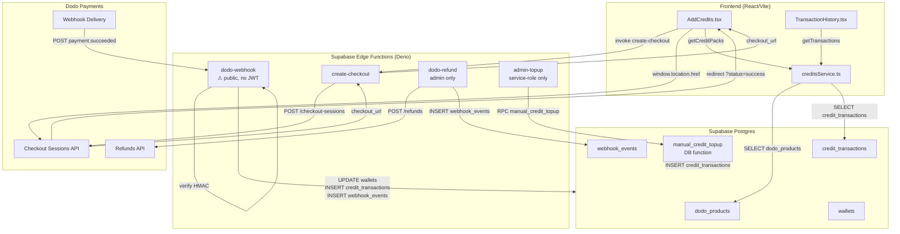
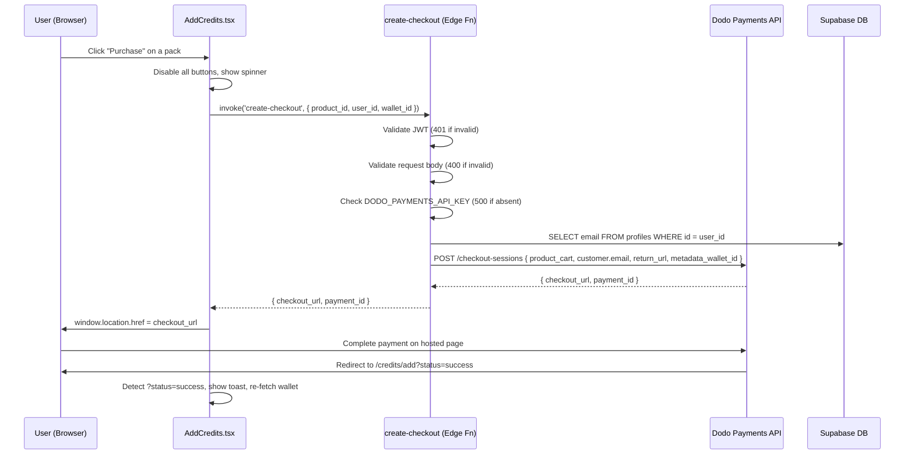
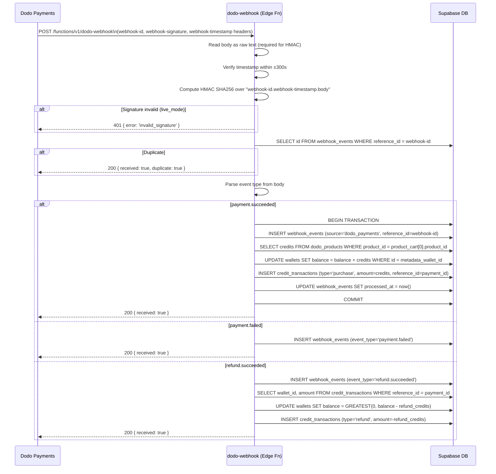
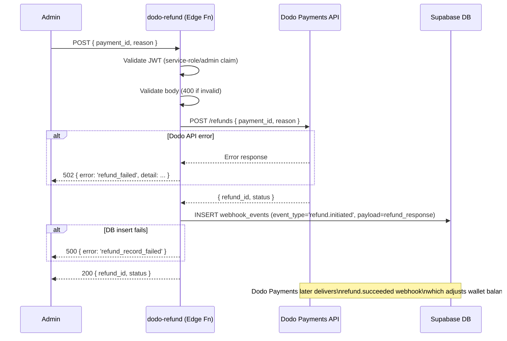

# Design Document — Dodo Payments Integration

## Overview

This document describes the technical design for integrating Dodo Payments as the credit top-up payment provider for Creozel. The integration replaces the existing Stripe `window.alert()` stub in `AddCredits.tsx` with a fully functional, server-side payment flow using Dodo Payments' hosted checkout, Standard Webhooks HMAC verification, and idempotent credit crediting.

The design follows the existing Supabase Edge Function pattern (`serve()`, `corsHeaders`, service-role `createClient`, `try/catch` with error reporting) established by `generate-content` and `oauth-connect`. All payment logic runs server-side in Deno Edge Functions; the frontend only redirects to and from the Dodo Payments hosted checkout page.

### Key Design Decisions

- **Hosted checkout only**: No card data ever touches Creozel servers. The frontend redirects to `checkout.dodopayments.com` and receives a `?status=success` or `?status=cancelled` query param on return.
- **Webhook-driven credit crediting**: Credits are added only after a verified `payment.succeeded` webhook, not on checkout return. This prevents race conditions and fraud.
- **Idempotency via `webhook_events.reference_id`**: The `webhook-id` header is stored as `reference_id` with a UNIQUE constraint, making duplicate webhook delivery safe.
- **Environment parity**: `DODO_PAYMENTS_ENVIRONMENT` (server) and `VITE_DODO_PAYMENTS_ENVIRONMENT` (client) must match; a mismatch causes all requests to fail fast with HTTP 500.
- **Test mode relaxes signature verification**: In `test_mode`, the webhook handler accepts payloads without a `webhook-signature` header to simplify local development with `dodo wh listen`.

---

## Architecture



---

## Components and Interfaces

### File Structure

```
supabase/
  functions/
    create-checkout/
      index.ts          # Checkout session creation
    dodo-webhook/
      index.ts          # Webhook receiver (public, no JWT)
    dodo-refund/
      index.ts          # Admin refund initiation
    admin-topup/
      index.ts          # Manual credit top-up (service-role)
  migrations/
    20260514000001_dodo_payments.sql   # dodo_products, schema updates
    20260514000002_manual_topup_fn.sql # manual_credit_topup DB function

frontend/src/
  types/
    index.ts            # + DodoProduct interface
  services/
    creditsService.ts   # + getCreditPacks()
  pages/credits/
    AddCredits.tsx      # Full rewrite — dynamic packs, sandbox badge, no alert()
    TransactionHistory.tsx  # + refund badge styling

docs/ops/
  dodo-payments-ops.md  # Operational runbook

.env.example            # + Dodo Payments variables
```

### Edge Function Interfaces

#### `create-checkout`

```typescript
// Request (POST, requires Authorization: Bearer <supabase_jwt>)
interface CreateCheckoutRequest {
  product_id: string   // must match a dodo_products.product_id row
  user_id:    string   // authenticated user's UUID
  wallet_id:  string   // user's wallet UUID
}

// Success Response (200)
interface CreateCheckoutResponse {
  checkout_url: string  // https://checkout.dodopayments.com/... or https://test.dodopayments.com/...
  payment_id:   string  // Dodo Payments payment identifier
}

// Error Responses
// 400: { error: 'invalid_request' }          — missing/empty fields
// 401: { error: 'unauthorized' }             — missing/invalid JWT
// 500: { error: 'payment_provider_not_configured' } — missing API key
// 502: { error: 'checkout_creation_failed' } — Dodo API error
```

#### `dodo-webhook`

```typescript
// Request (POST, public — no JWT required)
// Headers:
//   webhook-id:        string   (idempotency key)
//   webhook-signature: string   (Standard Webhooks HMAC SHA256, may be absent in test_mode)
//   webhook-timestamp: string   (Unix timestamp, must be within ±300s)
// Body: raw JSON string (must be read as text for HMAC verification)

// Supported event types in body.type:
//   'payment.succeeded' | 'payment.failed' | 'refund.succeeded'

// Success Response (200)
interface WebhookResponse {
  received:   true
  duplicate?: true   // present only when idempotency check fires
}

// Error Responses
// 401: { error: 'invalid_signature' }
// 422: { error: 'invalid_payload' }           — missing product_cart or metadata_wallet_id
// 422: { error: 'original_transaction_not_found' } — refund with no matching purchase
// 500: { error: 'webhook_secret_not_configured' }
// 500: (implicit) — triggers Dodo retry on DB failure
```

#### `dodo-refund`

```typescript
// Request (POST, requires Authorization: Bearer <service-role or admin jwt>)
interface DodoRefundRequest {
  payment_id: string   // Dodo Payments payment_id to refund
  reason:     string   // 1–500 characters
}

// Success Response (200)
interface DodoRefundResponse {
  refund_id: string
  status:    string
}

// Error Responses
// 400: { error: 'invalid_request' }
// 403: { error: 'forbidden' }
// 500: { error: 'refund_record_failed' }
// 502: { error: 'refund_failed', detail: string }
```

#### `admin-topup`

```typescript
// Request (POST, requires Authorization: Bearer <service-role jwt>)
interface AdminTopupRequest {
  amount:      number   // 1–1,000,000
  description: string
}

// Success Response (200)
interface AdminTopupResponse {
  new_balance: number
}

// Error Responses
// 401: { error: 'unauthorized' }
// 500: { error: 'topup_failed' }
```

### Frontend Component Interfaces

#### `DodoProduct` (new type in `src/types/index.ts`)

```typescript
export interface DodoProduct {
  id:            string
  product_id:    string
  label:         string
  credits:       number
  price_display: string
  is_active:     boolean
  is_popular:    boolean
}
```

#### `getCreditPacks()` (new export in `creditsService.ts`)

```typescript
export async function getCreditPacks(): Promise<DodoProduct[]>
// Queries dodo_products WHERE is_active = true ORDER BY credits ASC
// On error: calls reportError and returns []
// Filters out any rows where credits <= 0 or product_id is empty
```

#### `AddCredits.tsx` — key state shape

```typescript
type PurchaseState = 'idle' | 'loading' | 'redirecting' | 'error'

interface AddCreditsState {
  packs:          DodoProduct[]
  packsLoading:   boolean
  wallet:         Wallet | null
  purchaseState:  PurchaseState
  purchasingId:   string | null   // product_id of the pack being purchased
}
```

---

## Data Models

### New Table: `dodo_products`

```sql
create table public.dodo_products (
  id            uuid        default gen_random_uuid() primary key,
  product_id    text        unique not null,
  label         text        not null,
  credits       integer     not null check (credits > 0),
  price_display text        not null,
  is_active     boolean     not null default true,
  is_popular    boolean     not null default false,
  created_at    timestamptz not null default now()
);
```

Seed data:

| product_id | label | credits | price_display | is_popular |
|---|---|---|---|---|
| `prod_starter_100` | Starter Pack | 100 | $4.99 | false |
| `prod_creator_500` | Creator Pack | 500 | $19.99 | true |
| `prod_pro_1500` | Pro Pack | 1500 | $49.99 | false |

### Schema Updates: `credit_transactions`

```sql
alter table public.credit_transactions
  add column dodo_payment_id  text,
  add column dodo_product_id  text;
```

Both columns are nullable; existing rows default to NULL.

### Schema Updates: `webhook_events`

```sql
alter table public.webhook_events
  add column source       text,
  add column reference_id varchar(255);

create unique index webhook_events_reference_id_idx
  on public.webhook_events (reference_id)
  where reference_id is not null;
```

The `source` column allows `'dodo_payments'` alongside existing social platform values. The `reference_id` UNIQUE index enforces idempotency and satisfies the sub-10ms lookup requirement at scale.

### DB Function: `manual_credit_topup`

```sql
create or replace function public.manual_credit_topup(
  wallet_id    uuid,
  amount       integer,
  description  text,
  admin_user_id uuid
)
returns integer
language plpgsql
security definer
set search_path = public
as $$
declare
  new_balance integer;
begin
  if amount < 1 or amount > 1000000 then
    raise exception 'amount must be between 1 and 1000000';
  end if;

  update wallets
  set balance = balance + amount
  where id = wallet_id
  returning balance into new_balance;

  if not found then
    raise exception 'wallet not found';
  end if;

  insert into credit_transactions (wallet_id, type, amount, description)
  values (wallet_id, 'bonus', amount, description);

  return new_balance;
end;
$$;

-- Revoke from public; only service role can call
revoke execute on function public.manual_credit_topup from public;
```

---

## Data Flow Diagrams

### Checkout Flow



### Webhook Flow



### Refund Flow



---

## Correctness Properties

*A property is a characteristic or behavior that should hold true across all valid executions of a system — essentially, a formal statement about what the system should do. Properties serve as the bridge between human-readable specifications and machine-verifiable correctness guarantees.*

### Property 1: Signature Verification Rejects Tampered Payloads

*For any* webhook payload and any HMAC key, a request whose computed HMAC does not match the `webhook-signature` header (due to a tampered body, wrong key, or absent header in live mode) SHALL be rejected with HTTP 401, and the `webhook_events` table SHALL contain no new rows for that request.

**Validates: Requirements 4.2, 4.3, 10.7**

---

### Property 2: Idempotency — Duplicate Webhook-ID Is a No-Op

*For any* `webhook-id` that has already been successfully processed (i.e., a row exists in `webhook_events` with that `reference_id`), submitting the same webhook event a second time SHALL return HTTP 200 with `{ received: true, duplicate: true }` and SHALL NOT insert any additional rows into `credit_transactions` or modify `wallets.balance`.

**Validates: Requirements 4.4, 10.2**

---

### Property 3: Payment Processing Correctness

*For any* valid `payment.succeeded` payload where `credits_purchased > 0` and `metadata_wallet_id` references an existing wallet, processing the event SHALL increment `wallets.balance` by exactly `credits_purchased` and SHALL insert exactly one `credit_transactions` row of `type = 'purchase'` with `amount = credits_purchased`.

**Validates: Requirements 4.5, 10.1**

---

### Property 4: Refund Net Balance

*For any* wallet with balance `B`, after processing a `payment.succeeded` event for `credits_purchased` credits followed by a `refund.succeeded` event for `credits_refunded` credits (where `credits_refunded <= credits_purchased`), the net change to `wallets.balance` SHALL equal `credits_purchased - credits_refunded`.

**Validates: Requirements 4.7, 10.3**

---

### Property 5: Balance Floor at Zero

*For any* wallet with balance `B` and any refund amount `R` where `R > B`, after processing the refund `wallets.balance` SHALL be set to `0` and SHALL NOT go negative.

**Validates: Requirements 4.7, 10.4**

---

### Property 6: Manual Top-Up Arithmetic

*For any* wallet with balance `B` and any `amount` between 1 and 1,000,000 inclusive, calling `manual_credit_topup(wallet_id, amount, description, admin_user_id)` SHALL return `B + amount` and the wallet's stored balance SHALL equal `B + amount`.

**Validates: Requirements 5.1, 10.5**

---

### Property 7: Checkout Input Validation

*For any* request body where at least one of `product_id`, `user_id`, or `wallet_id` is absent, null, or an empty string, the `create-checkout` Edge Function SHALL return HTTP 400 with `{ error: 'invalid_request' }` and SHALL NOT call the Dodo Payments API.

**Validates: Requirements 3.2**

---

### Property 8: Checkout URL Is a Valid HTTPS URL

*For any* valid `product_id` matching an existing `dodo_products` row, the `checkout_url` returned by `create-checkout` SHALL be a string beginning with `https://` (specifically `https://checkout.dodopayments.com` in live mode or `https://test.dodopayments.com` in test mode).

**Validates: Requirements 10.6**

---

### Property 9: `getCreditPacks` Filters Invalid Rows

*For any* response from `dodo_products` (including rows where `credits <= 0` or `product_id` is an empty string), `getCreditPacks()` SHALL return only elements where `credits > 0` and `product_id` is a non-empty string.

**Validates: Requirements 10.8**

---

### Property 10: `getCreditPacks` Renders Correct Pack Count

*For any* non-empty array of `DodoProduct` objects returned by `getCreditPacks()`, the `AddCredits` component SHALL render exactly that many pack cards (one card per element in the array).

**Validates: Requirements 2.3, 9.2**

---

## Error Handling

### Edge Function Error Strategy

All Edge Functions follow the same pattern established by `generate-content` and `oauth-connect`:

```typescript
serve(async (req: Request) => {
  if (req.method === 'OPTIONS') return new Response('ok', { headers: corsHeaders })

  try {
    // 1. Read env vars — return 500 immediately if missing
    // 2. Validate JWT — return 401 if invalid
    // 3. Validate request body — return 400 if invalid
    // 4. Call external API — return 502 on API error
    // 5. Write to DB — return 500 on DB error (triggers retry for webhooks)
    // 6. Return success response
  } catch (err: unknown) {
    const message = err instanceof Error ? err.message : 'Unknown error'
    console.error('[function-name] error:', message)
    return new Response(
      JSON.stringify({ error: message }),
      { status: 500, headers: { ...corsHeaders, 'Content-Type': 'application/json' } }
    )
  }
})
```

### Error Classification

| Scenario | HTTP Status | Body | Retry? |
|---|---|---|---|
| Missing API key | 500 | `payment_provider_not_configured` | No |
| Missing webhook secret | 500 | `webhook_secret_not_configured` | No |
| Invalid JWT | 401 | `unauthorized` | No |
| Missing/empty request fields | 400 | `invalid_request` | No |
| Invalid webhook signature | 401 | `invalid_signature` | No |
| Stale webhook timestamp | 401 | `invalid_signature` | No |
| Duplicate webhook-id | 200 | `{ received: true, duplicate: true }` | N/A |
| Missing product_cart or wallet_id | 422 | `invalid_payload` | No |
| Original transaction not found (refund) | 422 | `original_transaction_not_found` | No |
| Dodo Payments API error | 502 | `checkout_creation_failed` / `refund_failed` | No |
| DB write failure (webhook) | 500 | (implicit) | **Yes** — Dodo retries |
| DB write failure (refund record) | 500 | `refund_record_failed` | No |

### Frontend Error Handling

- All `catch` blocks use `catch (error: unknown)` with `reportError` from `src/utils/errorReporter.ts`.
- No `window.alert()` calls anywhere in `AddCredits.tsx`.
- Toast notifications (existing project pattern) for all user-facing feedback.
- `create-checkout` invocation has a 10-second timeout; on timeout, show error toast and re-enable buttons.
- On `?status=success` return: show success toast, re-fetch wallet balance.
- On `?status=cancelled`: show informational toast, no balance re-fetch needed.

---

## Security Considerations

### HMAC Signature Verification (Standard Webhooks)

The `dodo-webhook` function implements the [Standard Webhooks](https://www.standardwebhooks.com/) specification:

1. Read the raw request body as text (not parsed JSON) — HMAC is computed over the raw bytes.
2. Construct the signed content: `"${webhook-id}.${webhook-timestamp}.${rawBody}"`.
3. Compute `HMAC-SHA256(signed_content, base64_decode(DODO_PAYMENTS_WEBHOOK_KEY))`.
4. Compare against each signature in the `webhook-signature` header (format: `v1,<base64_sig>`).
5. Reject if timestamp is more than 300 seconds old or in the future (replay attack prevention).
6. In `test_mode`, skip signature check if `webhook-signature` header is absent (allows `dodo wh listen` without signing).
7. In `live_mode`, always enforce signature — no exceptions.

### JWT Validation

- `create-checkout`: Validates user JWT via `supabase.auth.getUser(jwt)`. Uses the user's email from their profile for the Dodo checkout customer object.
- `dodo-refund`: Validates JWT and checks for service-role or admin claim. Returns 403 (not 401) to distinguish "authenticated but not authorized" from "not authenticated".
- `admin-topup`: Validates JWT for service-role claim. Returns 401 on any failure.
- `dodo-webhook`: **No JWT validation** — this endpoint is public by design (Dodo Payments cannot send a Supabase JWT). Security is provided entirely by HMAC signature verification.

### RLS Policies

- `dodo_products`: Authenticated users can SELECT `is_active = true` rows. No INSERT/UPDATE/DELETE for non-service-role callers.
- `webhook_events`: RLS enabled with no permissive policies for authenticated users. Service role bypasses RLS.
- `wallets` and `credit_transactions`: Existing policies unchanged — users can only read their own rows; writes are service-role only via Edge Functions.

### Secret Management

- `DODO_PAYMENTS_API_KEY` and `DODO_PAYMENTS_WEBHOOK_KEY` are stored as Supabase Edge Function secrets (never in source code or the frontend bundle).
- `VITE_DODO_PAYMENTS_ENABLED` and `VITE_DODO_PAYMENTS_ENVIRONMENT` are Vite build-time variables — they contain no secrets, only feature flags.
- The `manual_credit_topup` DB function uses `SECURITY DEFINER` with `search_path = public` and has `EXECUTE` revoked from `public`, so only service-role callers can invoke it.

### Environment Mismatch Protection

If `DODO_PAYMENTS_ENVIRONMENT` (server) and `VITE_DODO_PAYMENTS_ENVIRONMENT` (client) do not match, `create-checkout` logs an error and returns HTTP 500 on every request until the mismatch is resolved. This prevents accidentally processing live payments against a test frontend or vice versa.

---

## Testing Strategy

### Property-Based Testing Library

**[fast-check](https://fast-check.dev/)** — already available in the project's frontend test suite (see existing PBT files in `src/__tests__/pbt/`). For Edge Function properties, fast-check runs in the Deno test runner via `npm:fast-check`.

Each property test runs a minimum of **100 iterations**.

### Property Test Configuration

Each test is tagged with a comment referencing the design property:

```typescript
// Feature: dodo-payments-integration, Property 3: Payment Processing Correctness
```

### Unit Tests (Example-Based)

Focus on specific scenarios not covered by property tests:

- `create-checkout` returns 500 when `DODO_PAYMENTS_API_KEY` is absent (SMOKE)
- `dodo-webhook` returns 500 when `DODO_PAYMENTS_WEBHOOK_KEY` is absent (SMOKE)
- `payment.failed` event inserts `webhook_events` row but does not modify `wallets.balance`
- `refund.succeeded` with no matching `credit_transactions` row returns 422
- `AddCredits` shows loading skeletons while `getCreditPacks()` is in progress
- `AddCredits` shows "No credit packs available" when `getCreditPacks()` returns `[]`
- `AddCredits` shows success toast on `?status=success` URL param
- `AddCredits` shows cancelled toast on `?status=cancelled` URL param
- `TransactionHistory` renders refund rows with red "Refund" badge and leading minus sign
- `dodo_products` seed data contains exactly 3 rows with correct values

### Integration Tests

- End-to-end checkout flow in test mode using Dodo test cards (`4242424242424242`)
- Webhook delivery via `dodo wh listen` forwarding to local dev server
- `manual_credit_topup` called directly via Supabase RPC with service-role key
- Migration `npx supabase db push` exits with code 0 on a clean database

### Test File Locations

```
frontend/src/__tests__/pbt/
  dodoPaymentsSignature.pbt.test.ts    # Property 1
  dodoPaymentsIdempotency.pbt.test.ts  # Property 2
  dodoPaymentsProcessing.pbt.test.ts   # Properties 3, 4, 5
  manualTopup.pbt.test.ts              # Property 6
  checkoutValidation.pbt.test.ts       # Properties 7, 8
  getCreditPacks.pbt.test.ts           # Properties 9, 10

supabase/functions/create-checkout/
  index.test.ts                        # Unit tests

supabase/functions/dodo-webhook/
  index.test.ts                        # Unit tests

supabase/functions/dodo-refund/
  index.test.ts                        # Unit tests

supabase/functions/admin-topup/
  index.test.ts                        # Unit tests
```

