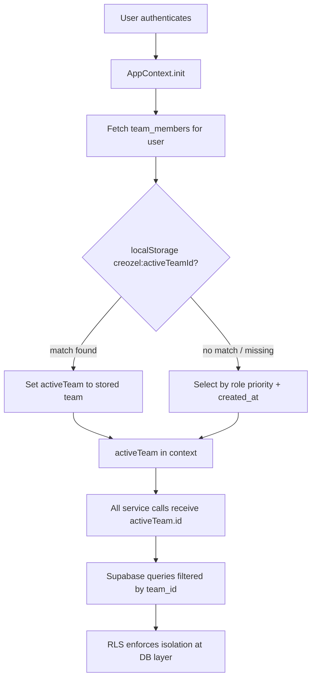
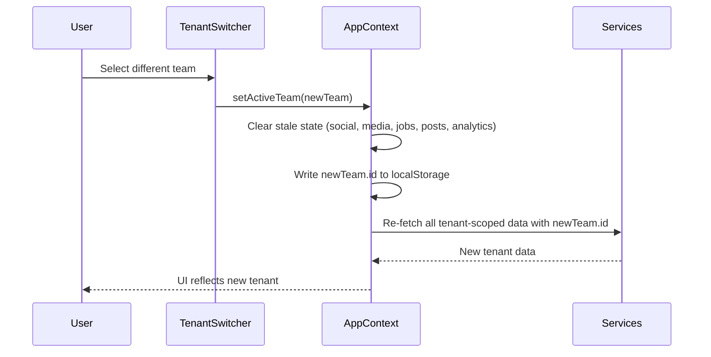
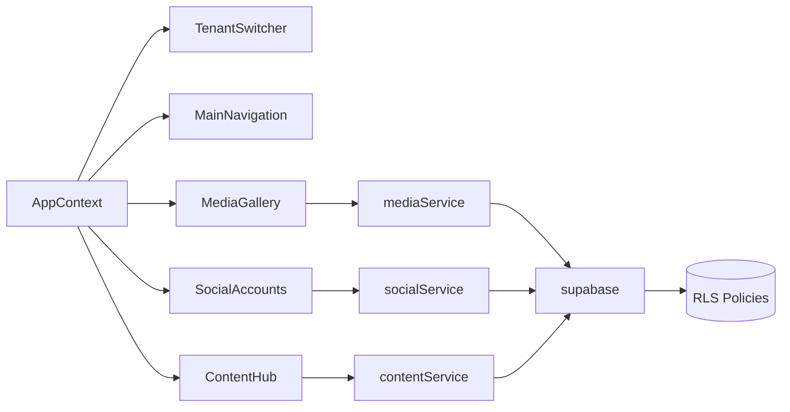

# Design Document — MVP SaaS Platform

## Overview

This document describes the technical design for the Creozel MVP SaaS Platform spec. The work spans four cross-cutting concerns:

1. **Full multi-tenant architecture** — `AppContext` gains `activeTeam`, a `TenantSwitcher` component, and `localStorage` persistence under `creozel:activeTeamId`.
2. **Navigation restructure** — Social Accounts and Media Library are promoted to top-level leaf nodes in `MainNavigation`.
3. **Tenant-scoped services** — `mediaService` and `socialService` are updated to require `team_id` on every query; the `oauth-connect` Edge Function is updated to embed and validate `team_id` in the OAuth `state` parameter.
4. **Advanced content generation tools** — `ContentHub` gains per-content-type advanced options panels with typed interfaces, collapsible UI, credit cost estimation, and `localStorage` persistence.

The project is a React 18 / TypeScript frontend backed by a self-hosted Supabase instance (PostgreSQL + Storage + Edge Functions). No new third-party libraries are introduced; all patterns follow the existing codebase conventions.

---

## Architecture

### Multi-Tenant Data Flow



### Team Switch Flow



### Component Dependency Map



---

## Components and Interfaces

### 1. AppContext Changes

The existing `AppContext` is extended with tenant state. The `AppContextType` interface gains:

```typescript
// New fields added to AppContextType
activeTeam: Team | null
teams: Team[]
setActiveTeam: (team: Team | null) => void
isTeamLoading: boolean
```

The `AppProvider` initialisation sequence on mount:

1. Resolve the authenticated user (existing behaviour).
2. Query `team_members` joined with `teams` for the user's `user_id`.
3. Read `creozel:activeTeamId` from `localStorage` (wrapped in try/catch for `SecurityError`).
4. If the stored ID matches a team in the resolved list, set `activeTeam` to that team.
5. Otherwise, apply role-priority selection: `owner` > `admin` > `editor` > `viewer`, with `created_at` ascending as tiebreaker.
6. If the user belongs to no teams, set `activeTeam` to `null`.

When `activeTeam` changes (via `setActiveTeam`):

1. Clear all tenant-scoped state slices (social connections, media items, content jobs, scheduled posts, analytics).
2. Write the new `team.id` to `localStorage['creozel:activeTeamId']` (or remove the key if `team` is `null`).
3. Trigger re-fetch of tenant-scoped data for the new team.

On logout, remove `creozel:activeTeamId` from `localStorage`.

### 2. TenantSwitcher Component

New component at `frontend/src/components/layout/TenantSwitcher.tsx`.

```typescript
interface TenantSwitcherProps {
  teams: Team[]
  activeTeam: Team | null
  onSwitch: (team: Team) => void
}
```

Rendered in the sidebar user card area of `MainNavigation`. When `activeTeam` is non-null, it replaces the personal user display with the team name and avatar. Switching teams calls `onSwitch` which delegates to `AppContext.setActiveTeam` — no URL navigation or `window.location` change occurs.

The component uses only icons already imported in `MainNavigation` (`ChevronDownIcon`, `UsersIcon`).

### 3. MainNavigation Restructure

The `navItems` array is restructured to the following top-level order, with Social Accounts and Media Library as leaf nodes (no `children` array):

| # | Title | href | Icon |
|---|-------|------|------|
| 1 | Home | `/` | `HomeIcon` |
| 2 | Create | `/content` | `SparklesIcon` |
| 3 | Autopilot | `/autopilot` | `RocketIcon` |
| 4 | Analytics | `/analytics` | `BarChart2Icon` |
| 5 | Publishing | `/calendar` | `SendIcon` |
| 6 | Social Accounts | `/social-accounts` | `GlobeIcon` |
| 7 | Media Library | `/media` | `FolderIcon` |
| 8 | Communication | `/messages` | `MessageSquareIcon` |
| 9 | Workflows | `/workflow` | `WorkflowIcon` |

**Publishing group children** (after restructure): Calendar (`/calendar`) only.

**Autopilot group children** (after restructure): Dashboard (`/autopilot`), Create Pipeline (`/autopilot/create`), Scheduler (`/autopilot/scheduler`).

No new icon imports are required — `GlobeIcon` and `FolderIcon` are already imported in the existing file.

The `TenantSwitcher` is rendered inside the sidebar user card section, replacing the static user display when a team is active.

### 4. MediaGallery Page Changes

`MediaGallery` reads `activeTeam` from `useAppContext()` instead of `user`. Every call to `mediaService` passes `activeTeam?.id ?? null` as `teamId`. The page header displays the active team name. When `activeTeam` changes, the component clears `items` and shows a loading skeleton before re-fetching.

### 5. SocialAccounts Page Changes

`SocialAccounts` reads `activeTeam` from `useAppContext()`. When `activeTeam` is `null`, the page renders an empty state with a "Create or join a team to manage social accounts" message and a CTA button. When `activeTeam` is set, every call to `socialService` passes `activeTeam.id`. The page header displays the active team name. When `activeTeam` changes, the component clears `connections` and re-fetches.

### 6. ContentHub Advanced Options

Each content type panel gains a collapsible `AdvancedOptions` section, defaulting to collapsed. The section is toggled by a chevron button labelled "Advanced options".

Advanced options state is typed with explicit interfaces:

```typescript
interface TextAdvancedOptions {
  model: 'gpt-4' | 'gpt-3.5'
  tone: 'professional' | 'casual' | 'humorous' | 'persuasive' | 'informative'
  outputFormat: 'blog_post' | 'caption' | 'ad_copy' | 'thread' | 'email'
  wordCountMin: number   // 1–10000
  wordCountMax: number   // 1–10000, must be >= wordCountMin
  language: string
  brandVoiceEnabled: boolean
}

interface ImageAdvancedOptions {
  provider: 'dall-e-3' | 'stable-diffusion'
  resolution: '512x512' | '1024x1024' | '1792x1024' | '1024x1792'
  style: 'photorealistic' | 'illustration' | 'digital_art' | 'oil_painting' | 'watercolor'
  negativePrompt: string  // max 500 chars
  numImages: number       // 1–4
  seed: number            // 0–2147483647
}

interface VideoAdvancedOptions {
  model: 'gpt-4' | 'gpt-3.5'
  sceneCount: number      // 1–10
  durationPerScene: 15 | 30 | 60
  aspectRatio: '16:9' | '9:16' | '1:1'
  includeBRoll: boolean
  brandVoiceEnabled: boolean
}

interface AudioAdvancedOptions {
  provider: 'elevenlabs' | 'whisper'
  voiceId: string
  speakingRate: number    // 0.5–2.0
  pitchAdjustment: number // -10 to +10
  outputFormat: 'mp3' | 'wav'
  stabilityClarity: number // 0–100, ElevenLabs only
}
```

**Credit cost estimate**: On mount and whenever advanced options change, `ContentHub` calls `getPricingConfig()` and computes the estimated cost based on the selected model/provider. If `getPricingConfig` returns an empty array (unreachable), the cost display area shows "Cost estimate unavailable" and hides any numeric figure.

**localStorage persistence**: Advanced options are saved under `{team_id}:{content_type}:advancedOptions`. On mount, the stored value is parsed; if parsing fails or `localStorage` is unavailable, defaults are used silently.

**Brand voice**: On mount, `ContentHub` fetches `brand_profiles` for the active team. If `voice_guidelines` is non-null, `brandVoiceEnabled` defaults to `true`. If the fetch fails, it defaults to `false`.

**Job submission**: When a job is submitted, all advanced option fields are spread into the `metadata` field of the `content_jobs` row.

---

## Data Models

### AppContext State (additions)

```typescript
// Added to AppProvider state
const [activeTeam, setActiveTeamState] = useState<Team | null>(null)
const [teams, setTeams] = useState<Team[]>([])
const [isTeamLoading, setIsTeamLoading] = useState(true)
```

The `Team` type already exists in `src/types/index.ts` and requires no changes.

### TeamMember with Role (for selection algorithm)

```typescript
interface TeamMemberWithTeam {
  team_id: string
  role: TeamRole
  created_at: string
  teams: Team  // joined
}
```

This is the shape returned by the Supabase query:
```sql
SELECT team_members.*, teams.*
FROM team_members
JOIN teams ON teams.id = team_members.team_id
WHERE team_members.user_id = $1
ORDER BY team_members.created_at ASC
```

### Role Priority Map

```typescript
const ROLE_PRIORITY: Record<TeamRole, number> = {
  owner:  4,
  admin:  3,
  editor: 2,
  viewer: 1,
}
```

Selection: `members.sort((a, b) => ROLE_PRIORITY[b.role] - ROLE_PRIORITY[a.role] || new Date(a.created_at).getTime() - new Date(b.created_at).getTime())[0]`

### Storage Path Format

Upload path: `{team_id}/{userId}/{Date.now()}_{filename}`

Example: `550e8400-e29b-41d4-a716-446655440000/auth-uid-123/1700000000000_hero.png`

The `{Date.now()}` prefix provides millisecond-precision uniqueness within a user's namespace.

### OAuth State Payload (updated)

```typescript
interface OAuthStatePayload {
  platform: string
  redirect_uri: string
  user_id: string
  team_id: string   // NEW — required, non-empty
}
```

The `state` parameter is `btoa(JSON.stringify(payload))`. The Edge Function validates that `team_id` is a non-empty string before proceeding; if absent or empty, it returns HTTP 400.

### content_jobs metadata (updated)

The `metadata` field now carries all advanced option values:

```typescript
// Example for text generation
metadata: {
  model: 'gpt-4',
  tone: 'professional',
  output_format: 'blog_post',
  word_count_min: 300,
  word_count_max: 800,
  language: 'en',
  brand_voice: '<guidelines text or null>',
}

// Example for image generation
metadata: {
  provider: 'dall-e-3',
  resolution: '1024x1024',
  style: 'photorealistic',
  negative_prompt: '',
  num_images: 1,
  seed: 42,
}
```

### RLS Policies

All tenant-scoped tables already have `team_id` columns. The RLS policies follow this pattern (shown for `media_items`; identical structure for `social_connections`, `content_jobs`, `scheduled_posts`, `pipeline_executions`, `analytics_events`):

```sql
-- SELECT: user must be a member of the team
CREATE POLICY "tenant_select" ON media_items
  FOR SELECT USING (
    team_id IN (
      SELECT team_id FROM team_members WHERE user_id = auth.uid()
    )
    OR (team_id IS NULL AND user_id = auth.uid())
  );

-- INSERT: user must be a member of the team they are inserting into
CREATE POLICY "tenant_insert" ON media_items
  FOR INSERT WITH CHECK (
    team_id IN (
      SELECT team_id FROM team_members WHERE user_id = auth.uid()
    )
    OR (team_id IS NULL AND user_id = auth.uid())
  );

-- UPDATE / DELETE: same membership check
```

Storage bucket RLS for the `media` bucket:

```sql
-- Deny access to files under a team_id prefix for non-members
CREATE POLICY "storage_tenant_select" ON storage.objects
  FOR SELECT USING (
    bucket_id = 'media'
    AND (
      -- Personal files: path starts with user's own ID
      (storage.foldername(name))[1] = auth.uid()::text
      OR
      -- Team files: first path segment is a team_id the user belongs to
      (storage.foldername(name))[1] IN (
        SELECT team_id::text FROM team_members WHERE user_id = auth.uid()
      )
    )
  );
```

The same policy structure applies for INSERT, UPDATE, DELETE on the `media` bucket.

---

## Correctness Properties

*A property is a characteristic or behavior that should hold true across all valid executions of a system — essentially, a formal statement about what the system should do. Properties serve as the bridge between human-readable specifications and machine-verifiable correctness guarantees.*

### Property 1: Active team selection by role priority

*For any* list of team memberships with varying roles and `created_at` timestamps, the team selection algorithm SHALL always return the team with the highest role priority (`owner` > `admin` > `editor` > `viewer`), using the earliest `created_at` as a tiebreaker when roles are equal.

**Validates: Requirements 1.2, 8.3**

---

### Property 2: Team switch clears stale tenant data

*For any* pair of teams A and B, when `setActiveTeam(B)` is called while team A is active, the intermediate state between the clear and the re-fetch SHALL contain no data rows whose `team_id` equals A's id.

**Validates: Requirements 1.4**

---

### Property 3: NavItems top-level order invariant

*For any* render of `MainNavigation`, the top-level `navItems` array SHALL always produce entries in the exact order: Home, Create, Autopilot, Analytics, Publishing, Social Accounts, Media Library, Communication, Workflows — and both Social Accounts and Media Library SHALL be leaf nodes with no `children` array.

**Validates: Requirements 2.7, 3.7, 7.1**

---

### Property 4: Media service team_id propagation

*For any* `activeTeam` value (including `null`), every call to `getMediaItems`, `uploadMediaItem`, and `deleteMediaItem` SHALL pass a `teamId` argument equal to `activeTeam.id` (or `null` when `activeTeam` is `null`), and every row inserted by `uploadMediaItem` SHALL have `team_id` set to that same value.

**Validates: Requirements 4.1, 4.2, 4.4**

---

### Property 5: Storage path format

*For any* combination of `team_id`, `userId`, and `filename`, the storage path generated by `uploadMediaItem` SHALL match the pattern `{team_id}/{userId}/{epoch_ms}_{filename}` where `epoch_ms` is a positive integer representing milliseconds since Unix epoch.

**Validates: Requirements 4.7**

---

### Property 6: Null activeTeam guard in media and social services

*For any* call to `uploadMediaItem`, `deleteMediaItem`, or `getSocialConnections` where `activeTeam` is `null` or `activeTeam.id` cannot be resolved, the function SHALL return `null` (or `[]` for list functions) without performing any Supabase database or storage operation.

**Validates: Requirements 4.9, 5.2**

---

### Property 7: Social service team_id propagation

*For any* `activeTeam` value, every call to `getSocialConnections` and `disconnectSocialAccount` SHALL pass `teamId` equal to `activeTeam.id`, and the OAuth `state` parameter constructed by `getOAuthUrl` SHALL contain a `team_id` field equal to `activeTeam.id`.

**Validates: Requirements 5.1**

---

### Property 8: OAuth callback team_id insertion

*For any* valid OAuth callback where the `state` parameter contains a non-empty `team_id`, the `oauth-connect` Edge Function SHALL insert a `social_connections` row with `team_id` equal to the value from `state`.

**Validates: Requirements 5.4**

---

### Property 9: OAuth callback rejects invalid state

*For any* OAuth callback request where the `state` parameter is absent, malformed (not valid base64 JSON), or contains an empty/missing `team_id`, the `oauth-connect` Edge Function SHALL return HTTP 400 and SHALL NOT insert any row into `social_connections`.

**Validates: Requirements 5.5**

---

### Property 10: Advanced options metadata round-trip through job submission

*For any* set of advanced option values selected in `ContentHub`, when a generation job is submitted, the `content_jobs` row's `metadata` field SHALL contain all selected advanced option values, and the `generate-content` Edge Function SHALL pass those values to the respective AI provider API call (e.g., `model`, `size`, `style`, `voice_id`, `speaking_rate`).

**Validates: Requirements 6.5, 6.7, 6.8**

---

### Property 11: Advanced options localStorage round-trip

*For any* `TextAdvancedOptions`, `ImageAdvancedOptions`, `VideoAdvancedOptions`, or `AudioAdvancedOptions` object and any `team_id` / `content_type` combination, serialising the options to `localStorage` under `{team_id}:{content_type}:advancedOptions` and then deserialising them SHALL produce an object that is deeply equal to the original.

**Validates: Requirements 6.10**

---

### Property 12: activeTeam localStorage persistence round-trip

*For any* team in the user's resolved team list, switching to that team SHALL write its `id` to `localStorage['creozel:activeTeamId']`, and mounting `AppContext` with that value already in `localStorage` SHALL initialise `activeTeam` to that same team.

**Validates: Requirements 8.1, 8.2**

---

### Property 13: Service functions return safe defaults on error

*For any* service function in `mediaService`, `socialService`, or `contentService`, when the underlying Supabase call throws an exception or returns an error object, the function SHALL return `null` for single-object return types, `[]` for array return types, or `false` for boolean return types — and SHALL NOT propagate the exception to the caller.

**Validates: Requirements 9.6**

---

## Error Handling

### AppContext

- All `catch` blocks use `catch (error: unknown)` and call `reportError('fetchTeamData [AppContext.tsx]', error)`.
- If the `team_members` fetch fails on mount, `isTeamLoading` is set to `false`, `teams` remains `[]`, and `activeTeam` remains `null`. The UI shows a generic error state.
- If `localStorage` throws a `SecurityError` when reading or writing `creozel:activeTeamId`, the error is silently swallowed and in-memory state is used.
- If a team switch re-fetch does not complete within 10 seconds, a `setTimeout` fires, sets an `isStaleDataError` flag, and the UI shows an error indication. No data from the previous tenant is displayed.

### mediaService

- `getMediaItems`: returns `[]` on any error.
- `uploadMediaItem`: returns `null` on any error; if `activeTeam.id` is unresolvable, returns `null` immediately without touching Supabase.
- `deleteMediaItem`: returns `false` on any error.
- All catch blocks call `reportError('mediaService.<functionName> [mediaService.ts]', error)`.

### socialService

- `getSocialConnections`: returns `[]` on any error; if `activeTeam` is `null`, returns `[]` immediately.
- `disconnectSocialAccount`: returns `false` on any error.
- `getOAuthUrl`: is a pure function and cannot fail; `team_id` is validated by the caller before this function is invoked.
- All catch blocks call `reportError('socialService.<functionName> [socialService.ts]', error)`.

### contentService

- `createContentJob`: throws to the caller (existing behaviour) because the caller must handle insufficient credits. All other functions return safe defaults.
- `getPricingConfig`: returns `[]` on any error; `ContentHub` treats an empty array as "pricing unavailable" and shows the error indication.
- All catch blocks call `reportError('contentService.<functionName> [contentService.ts]', error)`.

### oauth-connect Edge Function

- Missing or malformed `state`: returns HTTP 400 with `{ error: 'invalid_state' }`.
- Missing or empty `team_id` in state: returns HTTP 400 with `{ error: 'team_id_required' }`.
- All other errors: existing behaviour (redirect with `?error=...` query param).

### generate-content Edge Function

- Reads `job.metadata` fields with safe fallbacks (e.g., `job.metadata?.model ?? 'gpt-4'`) so that missing metadata fields do not cause the function to throw.
- All catch blocks follow the existing pattern (mark job as failed, release reserved credits).

### ContentHub

- If `brand_profiles` fetch fails: `brandVoiceEnabled` defaults to `false`; no error is shown to the user.
- If `getPricingConfig` returns `[]`: the credit cost display area renders "Cost estimate unavailable" in amber text; no numeric figure is shown.
- If `localStorage` is unavailable or the stored value is corrupt: advanced options initialise with defaults; no error is shown.
- If the voice list fetch fails (audio panel): the voice selector shows "Failed to load voices" and is disabled until a retry button is clicked.

---

## Testing Strategy

### Unit Tests

Unit tests cover specific examples, edge cases, and error conditions. They are co-located with source files under `__tests__/` directories.

Key unit test scenarios:

- `AppContext`: team selection algorithm with various role/date combinations; `localStorage` read/write/removal; null team handling; stale data timeout.
- `TenantSwitcher`: renders team name and avatar; calls `onSwitch` on click; does not navigate.
- `MainNavigation`: navItems array structure matches specified order; Social Accounts and Media Library are leaf nodes; Publishing and Autopilot children are correct.
- `mediaService`: `uploadMediaItem` with null `activeTeam` returns null without calling Supabase; storage path format matches pattern.
- `socialService`: `getSocialConnections` with null `activeTeam` returns `[]`; `getOAuthUrl` includes `team_id` in state.
- `ContentHub`: advanced options panel is collapsed by default; brand voice toggle reflects `voice_guidelines`; cost estimate shows error when pricing unavailable.
- `oauth-connect`: rejects requests with missing/empty `team_id` in state.

### Property-Based Tests

Property-based tests use **fast-check** (already available in the JS ecosystem; install with `npm install --save-dev fast-check` in `frontend/`). Each test runs a minimum of **100 iterations**.

Tag format: `// Feature: mvp-saas-platform, Property {N}: {property_text}`

```typescript
// Feature: mvp-saas-platform, Property 1: Active team selection by role priority
it('always selects the highest-priority role with earliest created_at tiebreaker', () => {
  fc.assert(fc.property(
    fc.array(fc.record({
      team_id: fc.uuid(),
      role: fc.constantFrom('owner', 'admin', 'editor', 'viewer'),
      created_at: fc.date().map(d => d.toISOString()),
      teams: fc.record({ id: fc.uuid(), name: fc.string(), owner_id: fc.uuid(), created_at: fc.date().map(d => d.toISOString()) }),
    }), { minLength: 1 }),
    (members) => {
      const selected = selectActiveTeam(members)
      const maxPriority = Math.max(...members.map(m => ROLE_PRIORITY[m.role]))
      expect(ROLE_PRIORITY[selected.role]).toBe(maxPriority)
    }
  ), { numRuns: 100 })
})
```

```typescript
// Feature: mvp-saas-platform, Property 5: Storage path format
it('storage path always matches {team_id}/{userId}/{epoch}_{filename}', () => {
  fc.assert(fc.property(
    fc.uuid(), fc.string({ minLength: 1 }), fc.string({ minLength: 1 }),
    (teamId, userId, filename) => {
      const path = buildStoragePath(teamId, userId, filename)
      expect(path).toMatch(new RegExp(`^${teamId}/${userId}/\\d+_${filename.replace(/[.*+?^${}()|[\]\\]/g, '\\$&')}$`))
    }
  ), { numRuns: 100 })
})
```

```typescript
// Feature: mvp-saas-platform, Property 11: Advanced options localStorage round-trip
it('serialise then deserialise produces deeply equal options', () => {
  fc.assert(fc.property(
    fc.record({
      model: fc.constantFrom('gpt-4', 'gpt-3.5'),
      tone: fc.constantFrom('professional', 'casual', 'humorous', 'persuasive', 'informative'),
      outputFormat: fc.constantFrom('blog_post', 'caption', 'ad_copy', 'thread', 'email'),
      wordCountMin: fc.integer({ min: 1, max: 10000 }),
      wordCountMax: fc.integer({ min: 1, max: 10000 }),
      language: fc.string({ minLength: 2, maxLength: 10 }),
      brandVoiceEnabled: fc.boolean(),
    }),
    fc.uuid(), // teamId
    (options, teamId) => {
      const key = `${teamId}:text:advancedOptions`
      localStorage.setItem(key, JSON.stringify(options))
      const restored = JSON.parse(localStorage.getItem(key) ?? '{}')
      expect(restored).toEqual(options)
    }
  ), { numRuns: 100 })
})
```

```typescript
// Feature: mvp-saas-platform, Property 13: Service functions return safe defaults on error
it('mediaService.getMediaItems returns [] when supabase throws', () => {
  fc.assert(fc.property(
    fc.string(), fc.option(fc.uuid()),
    async (userId, teamId) => {
      vi.spyOn(supabase, 'from').mockImplementationOnce(() => { throw new Error('network error') })
      const result = await getMediaItems(userId, teamId ?? undefined)
      expect(result).toEqual([])
    }
  ), { numRuns: 100 })
})
```

### Integration Tests

Integration tests run against the local Supabase instance (Docker Compose). They verify:

- RLS policies on `media_items`, `social_connections`, `content_jobs`: queries as a non-member return zero rows.
- Storage bucket RLS: non-member cannot read/write files under another team's prefix.
- `oauth-connect` Edge Function: valid callback with `team_id` inserts a row; invalid state returns 400.
- `wallets` trigger: creating a team row automatically creates a `wallets` row with `balance = 0`.
- Multiple social connections per platform per team: two rows with different `platform_account_id` values coexist.

### TypeScript Compilation Check

After all changes, run from `frontend/`:

```bash
npx tsc --noEmit
```

Expected: exit code 0, zero errors. This is the acceptance gate for Requirements 7.6 and 9.2.
